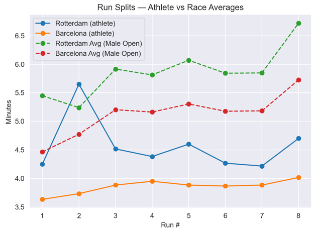
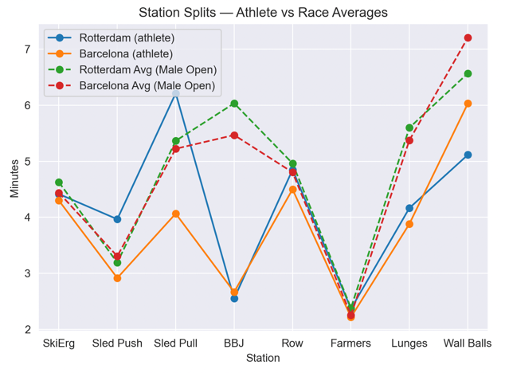

Python client to retrieve Hyrox race data as pandas DataFrames.

## Install

```commandline
uv pip install pyrox-client
```
or 
```commandline
pip install pyrox-client
```

## Quickstart
Below we have added two quick examples. One of loading race data - with different data requests, and one of retrieving race data / extracting athlete information and plotting values with example outputs to show a small glimpse of the analysis possible if 
retrieving the race data.

```commandline
import pyrox

# Create client
client = pyrox.PyroxClient()

# Discover available races
all_races = client.list_races()          
s6_races = client.list_races(season=6)   

# Get multiple races from a season
subset_s6 = client.get_season(season=6, locations=["london", "hamburg"])

# Get single race df
london_race = client.get_race(season=6, location="london")
rott_race = client.get_race(season=6, location="rotterdam")
london_male = client.get_race(season=6, location="london", gender="male")


```

## Methods

- list_races(season: int | None = None) -> pd.DataFrame 
- get_race(season: int, location: str, *, sex: str | None = None, division: str | None = None) -> pd.DataFrame 
- get_season(season: int, locations: list[str] | None = None) -> pd.DataFrame 
- get_race_stats(season: int, location: str) -> tuple[pd.DataFrame, pd.DataFrame] 
  


##  Example script showing comparison of an athlete's performance over 2 races against the average values in the race
```commandline
import pandas as pd
import numpy as np
import matplotlib.pyplot as plt
import seaborn as sns
import pyrox

client = pyrox.PyroxClient()


####   DATA Prep
run_cols = [f"run{i}_time" for i in range(1, 9)]
station_cols = [
    "skiErg_time","sledPush_time","sledPull_time","burpeeBroadJump_time",
    "rowErg_time","farmersCarry_time","sandbagLunges_time","wallBalls_time",
]
station_labels = ["SkiErg","Sled Push","Sled Pull","BBJ","Row","Farmers","Lunges","Wall Balls"]


def pick_athlete_row(df: pd.DataFrame, athlete: str) -> pd.Series:
    m = df["name"].astype(str).str.contains(athlete, case=False, na=False)
    sub = df[m]
    if sub.empty:
        raise ValueError(f"Athlete '{athlete}' not found")
    return sub.iloc[0]

def male_open(df: pd.DataFrame) -> pd.DataFrame:
    g = df["gender"].astype(str).str.lower().str.startswith("m")
    d = df["division"].astype(str).str.lower().str.contains("open")
    return df[g & d]


rot = client.get_race(season=6, location="rotterdam", gender="male", division="open")
bcn = client.get_race(season=7, location="barcelona", gender="male", division="open")
athlete = "surname, name"
user_rot = pick_athlete_row(rot, athlete)
user_bcn = pick_athlete_row(bcn, athlete)

rot_run_avg = rot[run_cols].mean()
bcn_run_avg = bcn[run_cols].mean()
rot_sta_avg = rot[station_cols].mean()
bcn_sta_avg = bcn[station_cols].mean()

# --- build comparison frames
runs_cmp = pd.DataFrame({
    "segment": range(1, 9),
    "Rotterdam (athlete)": [user_rot[c] for c in run_cols],
    "Barcelona (athlete)": [user_bcn[c] for c in run_cols],
}).set_index("segment")

stations_cmp = pd.DataFrame({
    "station": station_labels,
    "Rotterdam (athlete)": [user_rot.get(c, np.nan) for c in station_cols],
    "Barcelona (athlete)": [user_bcn.get(c, np.nan) for c in station_cols],
}).set_index("station")


sns.set_style("darkgrid")
plt.figure()
plt.plot(runs_cmp.index, runs_cmp["Rotterdam (athlete)"], marker="o", label="Rotterdam (athlete)")
plt.plot(runs_cmp.index, runs_cmp["Barcelona (athlete)"], marker="o", label="Barcelona (athlete)")
plt.plot(runs_cmp.index, rot_run_avg.values, marker="o", linestyle="--", label="Rotterdam Avg (Male Open)")
plt.plot(runs_cmp.index, bcn_run_avg.values, marker="o", linestyle="--", label="Barcelona Avg (Male Open)")
plt.xticks(runs_cmp.index)
plt.xlabel("Run #")
plt.ylabel("Minutes")
plt.title("Run Splits — Athlete vs Race Averages")
plt.legend()
plt.tight_layout()
plt.show()


plt.figure()
plt.plot(stations_cmp.index, stations_cmp["Rotterdam (athlete)"], marker="o", label="Rotterdam (athlete)")
plt.plot(stations_cmp.index, stations_cmp["Barcelona (athlete)"], marker="o", label="Barcelona (athlete)")
plt.plot(stations_cmp.index, rot_sta_avg.values, marker="o", linestyle="--", label="Rotterdam Avg (Male Open)")
plt.plot(stations_cmp.index, bcn_sta_avg.values, marker="o", linestyle="--", label="Barcelona Avg (Male Open)")
plt.xticks(rotation=0)
plt.xlabel("Station")
plt.ylabel("Minutes")
plt.title("Station Splits — Athlete vs Race Averages")
plt.legend()
plt.tight_layout()
plt.show()


```


## Output 



