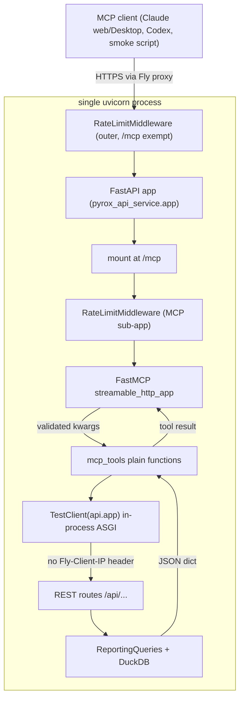

# mcp_surface — the public read-only MCP endpoint

`mcp_surface` is the repo's headline feature: a public, no-auth, read-only
Model Context Protocol server at `https://pyrox-api.fly.dev/mcp/` that lets
Claude (or any MCP client) answer natural-language questions about HYROX race
data. It is two files. `pyrox_api_service/mcp_app.py` is the composition point:
it builds a `FastMCP` server, registers ten tool functions on it, and mounts the
resulting streamable-HTTP ASGI sub-app at `/mcp` on the existing FastAPI app, so
REST and MCP ship as one process and one deploy. `pyrox_api_service/mcp_tools.py`
holds the tool logic — plain synchronous functions that call the REST API
in-process and reshape the JSON for a model. Nothing in the repo imports this
module; it is a leaf entry point, reached only by `uvicorn
pyrox_api_service.mcp_app:app` (which is exactly what the `Dockerfile` `CMD`
runs). The design rationale — why the server wraps the *hosted HTTP service*
rather than the `ReportingClient` library, and why the tools are intent-shaped
instead of a raw SQL surface — is recorded in
[docs/adr/0001-mcp-over-http-reporting-service.md](../docs/adr/0001-mcp-over-http-reporting-service.md)
and is not restated here. The short version of the accepted cost: a question the
curated endpoints cannot answer needs a new backend endpoint, not a prompt tweak.

## Where it sits

The mount is one-directional. `mcp_app` imports `pyrox_api_service.app` (the
FastAPI object), `pyrox_api_service.ratelimit`, and `pyrox_api_service.mcp_tools`;
`mcp_tools` in turn imports the same `app` module. Everything below the HTTP
boundary — routes, query building, DuckDB — belongs to
[service_runtime](service_runtime.md) and [reporting_engine](reporting_engine.md).



## The composition point (`mcp_app.py`)

Roughly 100 lines, all of it wiring:

- **Server construction.** `FastMCP(name="pyrox", stateless_http=True,
  streamable_http_path="/", transport_security=...)`. `stateless_http=True`
  means no per-session server state, which is what makes the endpoint
  restart-safe and multi-worker friendly. `streamable_http_path="/"` is a
  deliberate off-by-one fix: the sub-app is mounted at `/mcp`, so leaving the
  default would expose the endpoint at `/mcp/mcp`.
- **Tool registration.** A `TOOLS` tuple pairs each function with a display
  title, and a loop applies `mcp_server.tool(title=..., annotations=READ_ONLY_TOOL)`
  to each. `READ_ONLY_TOOL` is `ToolAnnotations(readOnlyHint=True,
  destructiveHint=False, idempotentHint=True, openWorldHint=False)` — honest for
  every tool here, since all ten are GETs against a read-only DuckDB snapshot.
  Input schemas and descriptions are derived by FastMCP from each function's type
  hints and docstring, so **the docstrings in `mcp_tools.py` are production
  prompt text**, not internal commentary.
- **Lifespan.** `app.router.lifespan_context = _lifespan` *replaces* the FastAPI
  app's lifespan context with one that runs `mcp_server.session_manager.run()`.
  Note the assignment semantics: this is not additive. If someone later adds a
  startup hook to `app.py` via a lifespan context, importing `mcp_app` would
  silently drop it. (Verified by reading; there is no current lifespan on
  `app.py`, so nothing is being clobbered today.)
- **Rate limiting and mount**, covered below.

`app.mount("/mcp", mcp_sub)` is the last statement in the file, and the module's
exported `app` is the FastAPI object imported from `pyrox_api_service.app` — the
same object the REST service uses. Importing `mcp_app` therefore mutates the
shared app as a side effect.

## The ten tools

Every tool is keyed to its real symbol name in `mcp_tools.py`. All of them
funnel through the private `_get(path, params)` helper, which drops `None`
params, calls the endpoint, and on a non-200 returns
`{"error": <detail>, "status_code": <code>}` instead of raising. This
error-as-value convention is the module's core contract: a tool never throws at
the model, it hands back a dict the model can read and retry from.

| Symbol | Endpoint | Intent |
| --- | --- | --- |
| `list_filters(season?, division?, gender?)` | `/api/filter-options` | Discover valid cohorts (seasons, divisions, genders, locations, age groups) before querying. |
| `list_races(season?, gender?)` | `/api/races` | Discover valid `season` + `location` pairs, with participant counts. |
| `find_athlete(name, limit=20, gender?, division?, match="best", nationality?, require_unique=False)` | `/api/athletes/search` | Resolve a name to candidate races carrying `result_id`. The entry point for anything athlete-specific. |
| `get_distribution(gender, season?, division?, metric="overall", age_group?, location?)` | `/api/distribution` | Histogram bins plus summary stats for a cohort. `gender` is the only required arg. |
| `get_race_summary(season, location, gender?, division?, age_group?, top_percentile?)` | `/api/race-summary` | count/min/max/mean/median/p10/p90 for every timing segment of one race. |
| `get_cohort_segment_averages(season, location, gender?, division?, age_group?, top_n?, bottom_n?)` | `/api/cohort-segment-averages` | Per-segment stats for a rank-based slice, split into `runs` and `stations`. `top_n` and `bottom_n` are mutually exclusive. |
| `get_rankings(season, division, gender, age_group?, athlete_name?, limit=20, target_time_min?)` | `/api/rankings` | Leaderboard for a cohort; `target_time_min` answers "where would this time place?". |
| `get_race_report(result_id, split_name?)` | `/api/reports/{result_id}` | Full split-by-split report for one result. |
| `get_deepdive(result_id, season, division?, gender?, age_group?, location?, metric="total_time_min")` | `/api/deepdive/{result_id}` | Cross-location cohort comparison anchored on one result. |
| `get_athlete_profile(name?, athlete_id?, division?)` | `/api/athletes/{id}/profile` or `/api/athletes/profile` | Career profile. Prefers `athlete_id`; falls back to `name`; returns a synthetic `{"error": ..., "status_code": 400}` if neither is given. |

Three shaping decisions are worth calling out because they are the "intent
shape" the ADR argues for, made concrete:

**Literal enums over free strings.** `Gender = Literal["male", "female", "mixed"]`
and `Division = Literal["open", "pro", "doubles", "pro_doubles"]` put the closed
vocabulary directly into the JSON schema, so a model picks from an enum rather
than guessing a string the service would 400 on, and often skips a `list_filters`
round-trip. `age_group` and `location` are deliberately left as free strings:
the source comment says they drift across seasons and events, so a frozen list
would go stale and reject valid new values.

**Two different metric vocabularies.** `DistributionMetric` is a set of friendly
keys (`"overall"`, `"run1"`, `"skierg"`, `"wallballs"`, …) that
`/api/distribution` normalizes and maps to columns; `DeepdiveMetric` is the raw
canonical column names (`"total_time_min"`, `"skiErg_time_min"`, camelCase and
all) because deepdive's default is already a column name and it exposes the
`run_time_min` / `work_time_min` / `roxzone_time_min` aggregates that
distribution does not. This asymmetry is intentional per the comments, but it is
a genuine sharp edge: a model that learns `"skierg"` from one tool cannot reuse
it in the other. If a future refactor unifies them, this is the place to look.

**`find_athlete` reshapes rather than passes through.** It is the only tool that
post-processes the payload: it rewrites the service's `races` list into
`{"total", "returned", "matches"}` so the model can see it is looking at a
truncated view. `DEFAULT_LIST_LIMIT = 20` caps list-returning tools so a call
does not dump a large row set into the model's context; the docstrings tell the
model to raise `limit` to drill in.

## The in-process call path

This is the part most worth understanding. At **module import time**,
`mcp_tools` does:

```python
_client = TestClient(api.app)
```

`starlette.testclient.TestClient` in production code looks alarming, but it is
being used as an ASGI client, not a test harness: it is an `httpx.Client` with a
custom ASGI transport, so a tool call drives the *real* FastAPI request path —
Pydantic validation, `Query(...)` defaults, the `_raise_http` error mapping,
even the request-logging middleware — without opening a network socket. The
module docstring calls this "an httpx ASGI transport", which is true in
substance but does not name `TestClient`; if you grep for `httpx` in this file
you will not find it.

Two consequences follow, and both matter:

1. **No `Fly-Client-IP` header.** In-process ASGI calls carry no Fly proxy
   header, which is precisely the signal `ratelimit.py` uses to distinguish
   edge traffic from internal traffic. So a tool's inner REST call is exempt
   from the limiter and is never charged twice, and the test suite (which also
   uses `TestClient`) is never throttled.
2. **The call is synchronous.** FastMCP calls a non-async tool function
   directly rather than off-loading it to a worker thread — in the installed
   SDK, `func_metadata.call_fn_with_arg_validation` ends in a bare
   `return fn(**arguments_parsed_dict)` for sync callables. `TestClient` runs
   its request through a blocking portal on a separate thread, so there is no
   deadlock, but the calling coroutine blocks until the DuckDB query finishes.
   **Inference, not verified by a test:** on the single Fly machine this means
   MCP tool calls serialize with each other and with concurrent REST requests
   for the duration of a query. Given the rate limit and the traffic profile
   this is probably fine, but it is the first thing to look at if the endpoint
   ever feels slow under load.

The package import is resilient rather than deferred: `mcp_tools` does a
module-level `try: from pyrox_api_service import app as api` with an
`except ModuleNotFoundError: import app as api` fallback so the file also works
when the service directory is run directly rather than as an installed package.
(The same pattern appears in `app.py` and `database.py`.) There is **no
in-function deferred import** anywhere in `mcp_tools.py` — if you were told
otherwise, the source disagrees. What *is* deferred is the database: `TestClient`
construction does not open DuckDB, because `database.py` resolves
`PYROX_DUCKDB_PATH` lazily at query time. That is what lets the unit tests
monkeypatch the env var per test after the module is already imported.

## Rate limiting at the MCP boundary

`RateLimitMiddleware` is applied twice, in two places, on purpose:

- In `app.py`: `app.add_middleware(RateLimitMiddleware, exempt_path_prefixes=("/mcp",))`
- In `mcp_app.py`: `mcp_sub.add_middleware(RateLimitMiddleware)` before the mount

The outer limiter exempts `/mcp` so that the `/mcp` → `/mcp/` redirect plus the
served request are not charged as two hits; the sub-app charges the real request
once at its own boundary. Both use the *same* module-level `_limiter` and
`_rate` in `ratelimit.py`, so a client's REST and MCP calls count against a
single per-IP moving window (default `60/minute`, override via
`PYROX_RATE_LIMIT`). The storage is in-memory, so the budget is per machine, not
global. See [service_runtime](service_runtime.md) for the limiter itself.

## Transport security: DNS-rebinding protection is off

Verified, and it is deliberate. `_split_env` reads `PYROX_MCP_ALLOWED_HOSTS` and
`PYROX_MCP_ALLOWED_ORIGINS`, and protection is enabled by
`enable_dns_rebinding_protection=bool(_allowed_hosts)` — i.e. **off unless an
operator supplies an allow-list**, and neither var is set in `fly.toml`. The
reasoning is documented in both `mcp_app.py` and a `fly.toml` comment: Host and
Origin validation exists to stop a malicious page pivoting through a victim's
browser into a localhost-bound server, but this endpoint is public, read-only,
no-auth, and behind Fly's HTTPS proxy, so it buys nothing here — while breaking
browser/Electron MCP clients such as the Claude web and Desktop connectors,
which send an `Origin` header and would get `403 Invalid Origin header`. The
`wiki/` notes describing this as an intentional default are accurate. Whether
you agree with the trade is a judgement call, but it is a considered one, not an
oversight — and setting `PYROX_MCP_ALLOWED_HOSTS` reverses it without a code
change.

## Testing: unit tests, and a smoke test that is no longer in CI

The claim that tool logic is kept in plain functions so it unit-tests without an
MCP session checks out. `tests/test_mcp_tools.py` has roughly two dozen tests
that seed a temporary DuckDB, point `PYROX_DUCKDB_PATH` at it, and call
`mcp_tools.get_distribution(...)` and friends as ordinary Python — no session,
no transport, no `mcp_app` import. Exactly one test in that file touches the
server: `test_mcp_server_registers_expected_tools` imports `mcp_app`, runs
`asyncio.run(mcp_app.mcp_server.list_tools())`, and asserts the exact ten names
plus `readOnlyHint`/`destructiveHint` on every one. That is a good split — the
expensive import is paid once, for the one assertion that needs it.

`scripts/smoke_mcp.py` is the live check. It is a real MCP client: `httpx`
async client → `streamable_http_client(url)` → `ClientSession` → `initialize()`,
`list_tools()`, `call_tool("list_filters", {})`. It asserts the tool set matches
`EXPECTED_TOOL_NAMES` **exactly** (missing *and* extra both fail), then that
`list_filters` returned non-empty `seasons`, `divisions`, `genders`, and
`locations` lists, and prints an `McpSmokeReport` (protocol version, server
name, tool names, four counts) as text or `--json`. `normalize_mcp_url` forces a
trailing slash unless the URL carries a query or fragment — the public endpoint
is `/mcp/`, and the redirect is what the outer limiter exemption is about.
`_format_exception` flattens `BaseExceptionGroup`, which matters because anyio
task groups wrap transport failures.

It was **dropped from CI in `e87ba7b`** ("ci: drop flaky live MCP smoke test
from deploy and refresh workflows") — the commit removed it from both
`deploy.yml` and `refresh-data.yml` along with the `uv` setup steps that only
existed to run it, because it timed out consistently against the live endpoint.
The plausible cause, given `fly.toml` (`auto_stop_machines = "stop"`,
`min_machines_running = 0`, and a cold boot that may re-fetch a ~1.16GB DuckDB
artifact), is that a 20-second per-operation timeout cannot cover a cold start —
that is an inference, not something the commit message states. So it is now a
manual post-deploy step:

```
PYROX_MCP_URL=https://pyrox-api.fly.dev/mcp/ uv run python scripts/smoke_mcp.py --json
```

Its own pure logic is still covered in CI by `tests/test_smoke_mcp.py`, which
exercises URL normalization, tool-set validation, payload extraction and the
happy path with a stub session — everything except the network.

## Adding a tool

There is a maintainer checklist in
[docs/maintainers/adding-mcp-tools.md](../docs/maintainers/adding-mcp-tools.md);
the short shape is that a new question type touches four places — a REST
endpoint in `app.py` plus query logic in `reporting_queries.py`
([reporting_engine](reporting_engine.md)), a function in `mcp_tools.py`, an entry
in `TOOLS` in `mcp_app.py`, and a name in `EXPECTED_TOOL_NAMES` in
`smoke_mcp.py`. That four-file cost is the ADR's accepted trade, made visible.
Note that the smoke test's exact-match assertion means forgetting the last step
fails the smoke run with `extra=[...]` rather than silently passing.

User-facing connector setup and the tool reference live in
[docs/mcp.md](../docs/mcp.md); operational notes (serving, deploy, manual smoke)
in [docs/maintainers/reporting-service.md](../docs/maintainers/reporting-service.md).
The [python_client](python_client.md) library is the *other* consumer path — the
one with `query(sql)` — and is deliberately not what this endpoint exposes.

## Open questions

- The lifespan replacement (`app.router.lifespan_context = _lifespan`) is a
  silent-override pattern. Nothing breaks today; it is a trap for later.
- Sync tool functions block the event loop for the duration of a DuckDB query
  (see above). No benchmark exists in the repo either way.
- `DistributionMetric` and `DeepdiveMetric` name the same underlying segments
  differently. Intentional per the comments, confusing in practice.
