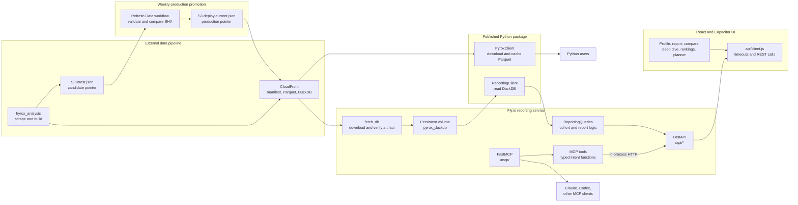

# pyrox-client architecture

Pyrox makes HYROX race-result data available through three surfaces: a Python
package, a REST/MCP reporting service, and a React application that can also be
packaged for iOS. This page is the engineering map for humans and agents. It
describes durable boundaries and operating contracts; the source remains the
authority.

Use [README.md](../README.md) and [docs/](../docs/) for user-facing guides,
maintenance runbooks, and architecture decisions. When documentation and code
disagree, trust code and tests first, then `docs/`, then this overview.

## How the system operates



The important boundary is the reporting engine. REST routes adapt HTTP inputs
to `ReportingQueries`; MCP tools call those same REST routes in-process instead
of reimplementing analytics. The UI calls REST over the network. The Python
client's Parquet path is independent of the hosted service.

## Deliverables and ownership

| Deliverable | Primary code | Runtime and consumers |
|---|---|---|
| `pyrox-client` package | [`src/pyrox/`](../src/pyrox/) | PyPI library for notebooks and Python applications |
| Reporting API and MCP | [`pyrox_api_service/`](../pyrox_api_service/) | One FastAPI process on Fly.io, backed by DuckDB |
| Web and mobile UI | [`ui/src/`](../ui/src/) | Vite/React web app; Capacitor produces the iOS shell |

The repository consumes race data but does not scrape or build the production
DuckDB database. The external `hyrox_analysis` pipeline publishes immutable
artifacts and the candidate `latest.json` pointer. This repository's weekly
[`Refresh Data`](../.github/workflows/refresh-data.yml) workflow validates a
changed candidate and copies that exact JSON to the consumer-owned
`deploy-current.json` pointer before refreshing Fly. On service boot,
[`fetch_db.py`](../pyrox_api_service/fetch_db.py) downloads only the production
pointer's artifact, checks its schema version and SHA-256, then atomically
installs it at `PYROX_DUCKDB_PATH`.

## Runtime paths

### Python client

[`PyroxClient`](../src/pyrox/core.py) reads a CDN manifest and race Parquet
files, caching them under the configured cache directory. It is the direct,
serverless access path. [`ReportingClient`](../src/pyrox/reporting.py) is an
optional DuckDB-backed helper and supplies the connection seam reused by the
hosted reporting service.

For manifest-backed client queries, a race edition is identified by
`(season, location, year)`. `list_races()` preserves that grain so repeated
locations in one season remain discoverable. A year-specific `get_race()`
returns one edition; omitting `year` intentionally concatenates every matching
edition for that season and location.

These paths have related but different schemas. Do not assume a column name
from CDN Parquet is identical to the reporting database's canonical
`*_time_min` columns. `PyroxClient.get_race()` maps raw Workout Summary times
and places onto paired public names such as `skiErg_time` / `skiErg_place` and
`run1_time` / `run1_place`.

### REST reporting

[`app.py`](../pyrox_api_service/app.py) owns FastAPI routes, query validation,
CORS, logging, rate-limit placement, and error-to-HTTP mapping. It should not
contain cohort math. [`reporting_queries.py`](../pyrox_api_service/reporting_queries.py)
owns searches, filters, race reports, distributions, rankings, profiles, and
planner/deep-dive calculations. [`database.py`](../pyrox_api_service/database.py)
resolves the concrete read-only DuckDB runtime.

The main request shape is:

`HTTP parameters → FastAPI route → ReportingQueries → ReportingClient/DuckDB → JSON`

### MCP

[`mcp_tools.py`](../pyrox_api_service/mcp_tools.py) contains plain,
intent-shaped functions. Each uses Starlette `TestClient` to enter the real
REST route in-process, so validation and reporting behavior stay shared.
[`mcp_app.py`](../pyrox_api_service/mcp_app.py) derives tool schemas from those
functions' type hints and docstrings, registers read-only annotations, and
mounts stateless streamable HTTP at `/mcp`.

Closed vocabularies must be represented in the type hints because MCP clients
discover their valid values from the generated JSON schema. The supported
`Division` values are:

`open`, `pro`, `doubles`, `pro_doubles`, `relay`, `adaptive`

Age groups and locations deliberately remain strings because their valid
values change with the dataset; agents discover them with `list_filters`.

### UI

[`App.jsx`](../ui/src/App.jsx) owns the six lazy-loaded page modes and the
small amount of cross-mode navigation. Page components live in
[`ui/src/pages/`](../ui/src/pages/). Shared charts, primitives, hooks, and
formatting utilities live beside them. [`api/client.js`](../ui/src/api/client.js)
is the browser's network boundary and owns request construction, React Query
defaults, endpoint-specific timeouts, and error parsing.

Capacitor wraps the same built frontend for iOS; it is not a separate data or
business-logic implementation.

## Durable contracts and constraints

- `result_id` is the stable hand-off from athlete search to race report and
  deep-dive requests. Preserve it across REST, MCP, and UI changes.
- Python-client race discovery preserves the `(season, location, year)` grain.
  Do not collapse repeated location names across years; callers may select one
  edition with `year` or combine all matching editions by omitting it.
- Reporting time values use canonical `*_time_min` columns. Friendly metric
  aliases are resolved at the reporting boundary rather than interpolated
  into SQL.
- `reporting_queries.py` is the single home for analytical behavior shared by
  REST and MCP. Protocol adapters validate and reshape; they do not fork the
  calculations.
- The public MCP surface is read-only, idempotent, and unauthenticated.
  External REST and MCP traffic share rate-limit storage; in-process MCP calls
  are exempt from double charging.
- The Fly machine may stop when idle. The persistent `/data` volume prevents a
  full DuckDB download on every cold start.
- `latest.json` is producer-owned candidate state; `deploy-current.json` is the
  consumer-owned live contract. The Tuesday 20:00 UTC refresh workflow promotes
  only a changed pointer accepted by this service's schema-version guard, then
  requires the restarted or awakened API to pass `/api/health`.
- `PYROX_MCP_ALLOWED_HOSTS` enables MCP Host/Origin validation. It is
  intentionally unset for the public Fly endpoint because browser/Electron
  connectors send Origin headers and the service is already public,
  read-only, and behind Fly HTTPS.
- The service refuses a data artifact whose schema version is newer than
  [`SUPPORTED_SCHEMA_VERSION`](../pyrox_api_service/fetch_db.py). It currently
  accepts schema version 3, which adds Workout Summary place fields and Best
  Run Lap without changing `result_id` or existing reporting columns.

## Change this here

| Change | Start here | Keep in sync |
|---|---|---|
| CDN download, manifest, or cache behavior | [`src/pyrox/core.py`](../src/pyrox/core.py) | Client tests and public client docs |
| DuckDB metric aliases or low-level reports | [`src/pyrox/reporting.py`](../src/pyrox/reporting.py) | Reporting tests |
| Cohort/reporting behavior | [`reporting_queries.py`](../pyrox_api_service/reporting_queries.py) | FastAPI adapter tests and relevant UI/MCP consumers |
| REST endpoint or validation | [`app.py`](../pyrox_api_service/app.py) | [`ui/src/api/client.js`](../ui/src/api/client.js), MCP wrapper, API tests |
| MCP input schema or tool behavior | [`mcp_tools.py`](../pyrox_api_service/mcp_tools.py) | registration in [`mcp_app.py`](../pyrox_api_service/mcp_app.py), schema tests, [MCP guide](../docs/mcp.md) |
| New MCP tool | [maintainer guide](../docs/maintainers/adding-mcp-tools.md) | REST route first, then tool, registration, tests, smoke script |
| UI mode or chart | [`ui/src/pages/`](../ui/src/pages/) or [`ui/src/charts/`](../ui/src/charts/) | API client and Vitest coverage |
| Service boot or deployment | [`Dockerfile`](../Dockerfile), [`fly.toml`](../fly.toml) | [reporting runbook](../docs/maintainers/reporting-service.md) |
| Production data promotion | [`refresh-data.yml`](../.github/workflows/refresh-data.yml) | pointer parser, Fly configuration, and reporting runbook |

## Build, test, and deploy

Source the repository virtual environment before Python commands:

```bash
source .venv/bin/activate
pytest -q
ruff check .
```

The UI has its own Node workflow:

```bash
cd ui
npm test -- --run
npm run build
```

Pushes to `main` run Python tests and integration checks. The
[`Deploy API`](../.github/workflows/deploy.yml) workflow deploys Fly
automatically only when backend/package code, `Dockerfile`, `fly.toml`,
`pyproject.toml`, or that workflow changes. Documentation-only and UI-only
commits do not trigger the API deploy. Tagged `v*` commits build and publish the
Python package to PyPI. The weekly refresh workflow promotes a supported
candidate pointer after the upstream data publish, refreshes every Fly machine,
and waits for the live health check. Its manual trigger handles out-of-cycle
backfills.

There is no UI deployment workflow in this repository; the Vite and Capacitor
builds are configured here, while hosting/release automation lives elsewhere.

## Maintaining this map

`codewiki_docs/overview.md` must remain the only file in this directory. Run
the `/codewiki` skill after architecture, ownership, stable contracts,
cross-component flows, or operating workflows change.

Do not update the overview for routine internal refactors that leave these
boundaries intact. Do not turn it into an issue tracker or symbol reference;
link to code and durable `docs/` instead. Every file-changing agent task must
finish by recording either that this map was updated or that the diff was
reviewed and did not change the map.
