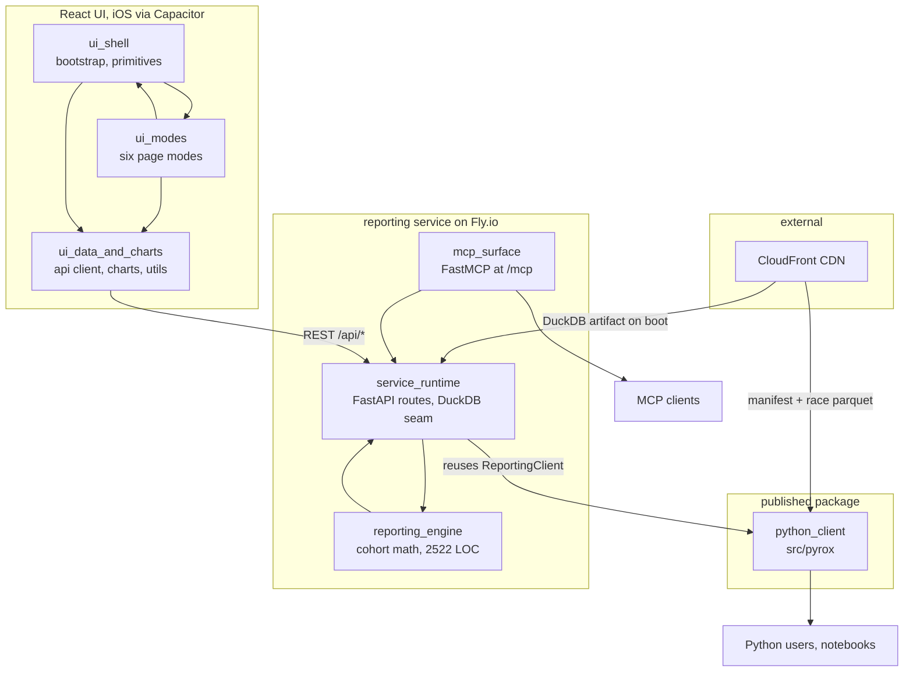

# pyrox-client — architecture overview

One repository, three deliverables, and a single upstream data source none of
them own. The `pyrox` client library is a published PyPI package. The reporting
service is a FastAPI app over a DuckDB artifact, deployed to Fly.io, which also
exposes a public read-only MCP endpoint. The UI is a Vite/React frontend that
doubles as an iOS app via Capacitor. The race data itself is built elsewhere —
the external `hyrox_analysis` repo scrapes and publishes everything consumed
here.

This page is generated. It maps the code as it exists at the baseline commit,
grounded in a static import graph of 48 source files, 217 top-level components
and 87 in-repo import edges. Nothing here is verified by tests, and where a
module page inferred rather than read, it says so. When this disagrees with
`docs/` or with the code, they win.

## The seven modules

| Module | Files | LOC | What it is |
|---|---|---|---|
| [python_client](python_client.md) | 9 | 2,171 | The PyPI wheel: `PyroxClient` over CDN parquet, `ReportingClient` over DuckDB |
| [service_runtime](service_runtime.md) | 5 | 721 | Fifteen read-only REST routes, rate limiting, the DuckDB seam, artifact boot |
| [reporting_engine](reporting_engine.md) | 2 | 2,522 | Every analytical question the product can answer |
| [mcp_surface](mcp_surface.md) | 3 | 654 | Ten intent-shaped MCP tools, mounted into the same ASGI app |
| [ui_shell](ui_shell.md) | 10 | 685 | Entry point, boot sequence, shared primitives, build config |
| [ui_modes](ui_modes.md) | 6 | 4,218 | The six analytical screens, one component each |
| [ui_data_and_charts](ui_data_and_charts.md) | 13 | 1,660 | The UI's leaf foundation: REST client, formatters, segment vocabulary, seven hand-built charts |

## Two read paths over the same data

The most important structural fact is that there are two independent ways to
read HYROX results, and they do not share a schema.

`PyroxClient` pulls a CSV manifest and per-race Parquet straight from the CDN
and caches locally under `~/.cache/pyrox`; no server is involved. The service
instead opens one ~1.16 GB DuckDB artifact, downloaded and sha256-verified on
container boot, and serves aggregates from it. As
[python_client](python_client.md) records, the two halves produce differently
named columns (`total_time` versus `total_time_min`) and no code path bridges
them — and nothing in production actually *creates* the DuckDB artifact's
tables, which are only ever built in tests.

The service does reuse the client library, but narrowly: `database.py` reaches
through `ReportingClient._ensure_connection()` — a private method — for a
DuckDB handle, and writes its own SQL for everything else. That reach-through
is the single most load-bearing coupling in the repo, and it is undeclared by
any interface.

## Request paths

A UI request goes `ui_modes` → `ui_data_and_charts`'s `apiFetch` → REST route
in `service_runtime` → `ReportingQueries` in `reporting_engine` → DuckDB. An
MCP request goes FastMCP → an in-process `TestClient` call that re-enters the
*same* REST route, so both protocols share one implementation and one deploy.
That is the ADR's intent — cohort math in exactly one place — and it holds at
the boundary, though [reporting_engine](reporting_engine.md) notes three
distinct cohort definitions coexisting *inside* the engine.

## What generation surfaced

Findings from reading the source, worth triaging rather than taking on faith:

- **`/api/health` returns the DuckDB filesystem path** on a public,
  unauthenticated endpoint, while the shared error handler goes out of its way
  to redact exactly that path elsewhere. See
  [service_runtime](service_runtime.md).
- **No connection reuse.** A fresh `ReportingClient`, and therefore a fresh
  `duckdb.connect`, is constructed per call; `athlete_profile_by_name` opens
  two per request. This corroborates the existing slowness investigation.
- **Profile percentile cost is multiplicative** — roughly 110 full-table
  queries for a ten-race athlete, per [reporting_engine](reporting_engine.md).
  A plausible next hotspot.
- **Sync MCP tool functions block the event loop** for the duration of each
  DuckDB query, so MCP calls serialize with each other and with REST on a
  single machine. Flagged as inference in [mcp_surface](mcp_surface.md).
- **Dead code with live CSS**: `SeasonProgressionChart.jsx` was added in a WIP
  commit and never wired to anything; `AppLoadingScreen.jsx` has zero
  importers. Both retain stylesheet vocabulary that is now unreachable.
- **Two of `useAppBootstrap`'s three boot steps are no-ops**, reading and
  discarding localStorage keys nothing else writes.
- **Substantial duplication across the six page modes** — the filter-options
  query block, the athlete-search handler and the race-card JSX are each
  copy-pasted four or five times. See [ui_modes](ui_modes.md).
- **Client/server contract gaps**: four client functions treat parameters as
  optional that the FastAPI routes declare required, so omission surfaces as a
  422 rather than a client-side guard. Five server routes have no client
  function at all.

## Reading order

New to the repo: start with [service_runtime](service_runtime.md) for the
request path, then [reporting_engine](reporting_engine.md) for what the product
actually computes. For the frontend, [ui_shell](ui_shell.md) then
[ui_data_and_charts](ui_data_and_charts.md) before
[ui_modes](ui_modes.md) — the modes make far more sense once the shared
foundation is familiar. [python_client](python_client.md) is independent of all
of it, and [mcp_surface](mcp_surface.md) is a thin, readable layer best read
last.

Canonical human-written material lives in `docs/` — runbooks under
`docs/maintainers/`, decisions under `docs/adr/`. This wiki links to them
rather than restating them.
