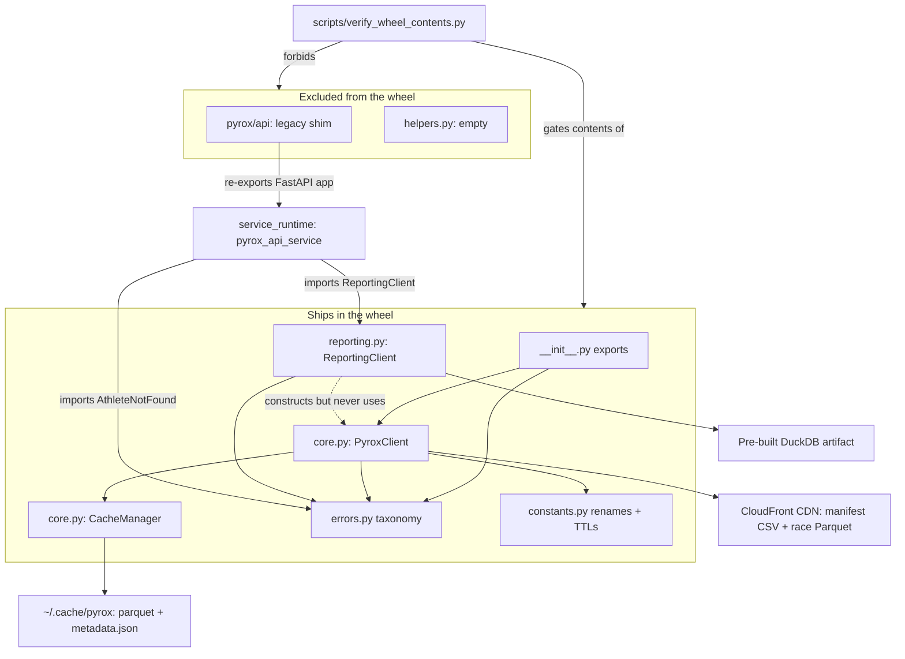

# python_client

`src/pyrox/` is the published `pyrox-client` package — the only code in this
repository that ships to PyPI. Everything else here (the FastAPI service, the
MCP surface, the UI) is repo-local scaffolding built *around* this package.
The module's job is narrow: give a Python user a `PyroxClient` that pulls HYROX
race results from a public CloudFront CDN into a pandas DataFrame, cache the
result locally so repeated analysis is cheap, and raise a small set of
predictable exceptions when a race or athlete does not exist. A second,
optional layer — `ReportingClient` in `reporting.py` — bolts DuckDB onto the
side for cohort/percentile analytics over a *pre-built* database artifact. The
two layers share a package but, as explained below, they do not actually share
a data path.

User-facing documentation for this package lives in the mkdocs site: see
[docs/quickstart.md](../docs/quickstart.md), [docs/caching.md](../docs/caching.md),
[docs/errors.md](../docs/errors.md) and [docs/filters.md](../docs/filters.md).
This page is the internals map, not the user manual.

## The two data paths

The single most useful thing to hold in your head is that `core.py` and
`reporting.py` read from completely different places:

- **`PyroxClient` (core.py)** reads a CSV manifest and per-race Parquet files
  over HTTPS from `https://d2wl4b7sx66tfb.cloudfront.net`, via `httpx` for the
  manifest and `fsspec` + `pyarrow.parquet` for the race files. It caches
  DataFrames as Parquet under `~/.cache/pyrox`.
- **`ReportingClient` (reporting.py)** opens a DuckDB database and queries
  tables named `race_results`, `race_rankings`, `split_percentiles`,
  `athlete_index` and `athlete_results`. **Nothing in this module — or anywhere
  in production code in this repo — creates those tables.** The only `CREATE
  TABLE` statements for them live in `tests/test_reporting.py` and
  `tests/test_mcp_tools.py`. The real artifact is built out-of-repo and fetched
  by the service (see [service_runtime](service_runtime.md)).

The column names differ across the two paths too. `core.py` renames the raw
`work_1..work_8` / `run_1..run_8` columns to `skiErg_time`, `sledPush_time`,
`run1_time`, … (via `constants.WORK_STATION_RENAMES`) and converts them to
float minutes. `reporting.py` expects the *same* concepts suffixed `_time_min`
(`skiErg_time_min`, `run1_time_min`, `total_time_min`). So a DataFrame produced
by `PyroxClient.get_race()` will not satisfy any `ReportingClient` query as-is.
I did not find code anywhere that bridges the two naming schemes; treat them as
two separate contracts that happen to describe the same sport.

## `core.py` — fetching and caching

### `CacheManager`

A flat, file-per-key cache under `~/.cache/pyrox` (overridable via
`PyroxClient(cache_dir=...)`). Keys are hashed with MD5 to produce
`<hash>.parquet` filenames; a sibling `metadata.json` maps the *unhashed* key
to `{timestamp, etag, path, rows, size_mb}`. `is_fresh` is a pure TTL check
against `timestamp`; `get_etag` returns the stored ETag; `store` writes Snappy
Parquet then updates metadata; `load` reads it back, self-healing by deleting
metadata entries whose Parquet file is missing or unreadable.

Concurrency is handled with a single `RLock` that guards the in-memory
`metadata` dict and the `metadata.json` write. Note what it does **not** guard:
`store()` writes the Parquet file *before* taking the lock, and `clear()`
unlinks files outside it. Within one process this is fine because keys are
distinct per query; across processes there is no locking at all, so two
concurrent Python processes sharing `~/.cache/pyrox` can interleave
`metadata.json` writes and lose entries. I have not seen this fail in practice,
but the code offers no protection against it.

### `PyroxClient` — manifest and race retrieval

`_get_manifest()` fetches `manifest/latest.csv` from the CDN under the cache
key `manifest_cdn_v1` with a two-hour TTL. Two things are worth knowing:

1. **ETag revalidation only happens after the TTL has already expired.** The
   fresh-cache check short-circuits before any HTTP request, so the
   `If-None-Match` header is only ever sent on a stale-or-forced fetch. The
   ETag therefore saves bandwidth, not a round trip.
2. **The 304 path has a hole.** If the server answers `304 Not Modified` and
   the local Parquet has meanwhile been deleted, `self.cache.load()` returns
   `None`, control falls through to `resp.raise_for_status()` (which does not
   raise on 3xx) and then to `pd.read_csv` on an empty body. I have not
   reproduced this, but reading the code that path looks like it ends in a
   pandas parse error rather than a clean refetch.

`list_races`, `list_seasons`, `list_locations` and `list_years` are thin
projections over the manifest, all case-folded and de-duplicated via the two
static helpers `_unique_int_values` / `_unique_str_values`.

`_manifest_row(season, location, year)` resolves a query to a single manifest
row. When `year` is `None` and a location has hosted races in multiple years it
takes `.iloc[0]` — i.e. **an arbitrary year wins silently**. Callers who care
must pass `year`. When the mask matches nothing,
`_build_manifest_not_found_error` constructs a richly-populated `RaceNotFound`:
it walks season → location → year in order, attaches `available_seasons`,
`available_locations`, `available_years`, and runs `difflib.get_close_matches`
(cutoff 0.6, top 3) over locations to produce a "Did you mean:" suggestion
list. This is the nicest error-construction code in the module.

`_get_race_from_url` opens the Parquet through `fsspec` and pushes `gender` /
`division` down as pyarrow row-group filters, so those two filters really are
applied before data reaches pandas. It re-raises `RaceNotFound` but wraps
**every other exception** — DNS failure, TLS error, HTTP 403, corrupt Parquet —
in a `FileNotFoundError`. That is a deliberate narrowing (and `docs/errors.md`
documents it), but it does mean a transient network fault is indistinguishable
from a genuinely absent file.

### `get_race` — the main entry point

The cache key encodes season, location, year, gender, division and a
normalised representation of the `total_time` argument, so different filter
combinations never collide. `total_time` accepts either a scalar (interpreted
as a strict upper bound) or a `(lower, upper)` tuple with either side `None`;
both bounds are applied as *strict* inequalities, so it is an open interval.
Unlike gender/division, the time filter is applied in pandas after download,
because it operates on the converted-to-minutes column.

Two ordering details matter. The station-rename and `mmss_to_minutes`
conversion happen **before** caching, so what lands in the cache is the
post-rename, post-conversion, post-time-filter frame — replaying a cached call
skips all of that work. And the TTLs here are hardcoded literals (`7200` in
`get_race`, `3600` in `get_season`) rather than the `constants.py` values that
exist for exactly this purpose; `ONE_HOUR_IN_SECONDS` and
`ONE_HOUR_IN_MINUTES` are defined and referenced nowhere.

`get_athlete_in_race` delegates to `get_race` and then filters with
`Series.str.contains(lower_name)`. `str.contains` defaults to `regex=True` and
the input is not escaped, so a name containing regex metacharacters is
interpreted as a pattern. Most athlete names are harmless; a query containing
`(` or `[` would raise a regex error rather than an `AthleteNotFound`.

`get_season` fans out over `list_races(season=...)` with a
`ThreadPoolExecutor` (default 8 workers), one `get_race` per location, and
swallows `RaceNotFound` per-future so a single missing race does not sink the
batch. Because it calls `get_race` without a `year`, it inherits the arbitrary
multi-year selection described above. When no frames survive it returns an
empty DataFrame *without* caching it, so a failing season query re-fans-out
every time.

`clear_cache` and `cache_info` are the public cache-management surface;
`cache_info` sums the `size_mb` values recorded at store time rather than
stat-ing the files, so it drifts if files are removed out-of-band.

### Loose ends in `core.py`

`_normalise_s3_path` has no callers anywhere in the repo — `_s3_key_from_uri`
does the equivalent job for the CDN path. The `mmss_to_minutes` helper sits at
the bottom of the file under a comment saying it should move to a separate file
"as they grow"; that separate file (`helpers.py`) exists and is empty.

## `constants.py` and `errors.py`

`constants.py` is 25 lines: two TTL constants (one used, one not), a minutes
constant (unused), the Snappy compression name, and `WORK_STATION_RENAMES` —
the authoritative mapping from the CDN's positional `work_N` / `run_N` columns
to HYROX station names. That mapping is the closest thing this module has to a
domain schema.

`errors.py` defines a deliberately small hierarchy: `PyroxError(Exception)` as
the catch-all, with `RaceNotFound` and `AthleteNotFound` each inheriting from
both `PyroxError` and `LookupError` so they feel natural in `try`/`except
LookupError` lookup code. Only `RaceNotFound` carries structured payload
(`season`, `location`, `year`, `available_*`, `suggestions`); `AthleteNotFound`
is a bare marker class. Note that `RaceNotFound` is also raised from
`_get_race_from_url` for the "filters matched zero rows" case, where none of
the structured fields are populated — so consumers must treat those attributes
as optional even though `__init__` always defaults them to empty lists.
`__all__` in `errors.py` and `__init__.py` agree, and `__init__.py` additionally
carries `__version__` (currently `0.2.5`), which `hatch` reads as the package
version and `scripts/release.sh` rewrites by regex.

## `reporting.py` — DuckDB analytics

`ReportingClient` is a query layer over an existing DuckDB file. The
constructor takes an optional `PyroxClient` and an optional `database` path
(default `":memory:"`). `_ensure_connection()` lazily opens the connection and
forces `read_only=True` for any non-in-memory database — that read-only flag is
what makes the otherwise-unrestricted `query(sql, params)` passthrough
tolerable.

**`self.client` is dead.** It is assigned in `__init__` and never read again
anywhere in the file. The class docstring compounds this by documenting a
`load_race_table(season=..., location=...)` method that does not exist — a
doctest-shaped example for a removed API. If you were looking for the seam
where CDN data gets loaded into DuckDB, it is not here; it was presumably
removed when the DuckDB artifact became an external build product.

The module's real surface is four query methods plus a helper layer:

- **`search_athlete_races`** — token-based athlete lookup against
  `athlete_index`, then a join through `athlete_results` into `race_results`.
  Matching is deliberately tolerant: names are lower-cased and stripped of
  punctuation, tokens are matched with `LIKE '%token%'`, and doubles-team names
  are split on `/`, `&`, `+`, `and`, `x`, `|` and (conditionally) commas so a
  single partner's name matches a pair entry. `match` selects `exact` /
  `contains` / `best` (exact-if-any, else contains); `require_unique=True`
  raises a `ValueError` listing up to five candidates rather than guessing.
- **`race_report`** — the big one. For a single `result_id` it returns a dict of
  DataFrames: the race row enriched with event/season/overall rank and
  percentile, the demographic cohort (same season/location/division/gender/
  age_group, compared with `IS NOT DISTINCT FROM` so NULLs match NULLs), the
  athlete's split percentiles, the cohort's split percentiles, and — unless
  `cohort_time_window_min=None` — a ±N-minute `total_time_min` cohort for the
  same location/season plus its splits and a Python-computed
  `split_percentile_time_window` column. Percentiles are consistently
  "higher is better": `1.0 - PERCENT_RANK()` over ascending time.
- **`deepdive_location_stats`** — per-location distribution of one metric across
  a season, with the athlete's own value marked. Filters default to the
  athlete's own division/gender/age_group and can be overridden; gender is
  normalised so `m`/`male` and `f`/`female` both match. Returns summary stats
  and histograms for four bands (all, top 5%, podium/top-3, bottom 10%).
- **`deepdive_filter_options`** — distinct locations and age groups for
  populating dropdowns; consumed by the UI through the service.

The helper layer is worth knowing about because it is where the safety lives.
`_TIME_COLUMNS` is an explicit allowlist of queryable time columns and
`_build_time_column_aliases` expands each into several spellings
(`sledPush`, `sledPush_time`, `sledPush_time_min`, plus `total`, `run_total`,
`work_total`). `_resolve_time_column` maps a user string through that allowlist
and raises `ValueError` otherwise — which is what makes the f-string
interpolation of `{metric_column}` into SQL safe. Never interpolate a column
name into these queries without routing it through `_resolve_time_column`.
`_build_histogram` and `_build_histogram_with_locations` produce the bucket
structures the charts consume (see [ui_data_and_charts](ui_data_and_charts.md));
both apply a `min_value` floor of 1.0 minute for `run*` columns, which quietly
drops implausible sub-minute run splits. `_log_df_stats` logs row count and
deep memory usage per query stage under the `pyrox.reporting` logger — useful
when a report is slow.

Two dependency gotchas. `duckdb`, `pandas` and `numpy` are imported at module
top level, so `import pyrox.reporting` fails outright unless the package was
installed as `pyrox-client[reporting]`. And `plot_cohort_distribution` imports
`matplotlib` and `seaborn` *inside* the function — deliberately, since neither
is declared in the `reporting` extra; they only exist in the `dev` dependency
group. Plotting from a plain `[reporting]` install will raise `ImportError`.

`race_report` and `plot_cohort_distribution` have no production callers in this
repository — only tests exercise them. They are library API for notebook users
rather than service internals.

## How the service reuses this module

The inbound dependency is real and load-bearing.
`pyrox_api_service/database.py` imports `ReportingClient` from this package
(with a `try: from pyrox.reporting ... except ModuleNotFoundError: from
src.pyrox.reporting ...` fallback so the service also runs straight from a repo
checkout). Its `DuckDBRuntime` dataclass resolves a DuckDB path from
`PYROX_DUCKDB_PATH`, then either hands out a `ReportingClient` or reaches
through it for a raw connection via `reporting_client()._ensure_connection()` —
a private method, called across a module boundary. `pyrox_api_service/app.py`
likewise imports `AthleteNotFound` from `pyrox.errors` and maps it to HTTP 404.

So the wheel's `ReportingClient` is simultaneously a public library class and
the server's database access layer, and its DuckDB connection lifecycle is the
service's connection lifecycle. Practical consequence: `DuckDBRuntime` builds a
fresh `ReportingClient` per call and `ReportingClient` never closes its
connection, so each runtime call opens a new read-only DuckDB handle. Whether
that matters under load is a question for [service_runtime](service_runtime.md)
rather than this page. The service uses only three `ReportingClient` methods —
`search_athlete_races`, `deepdive_filter_options`, `deepdive_location_stats` —
and writes its own SQL, in `pyrox_api_service/reporting_queries.py`, for
everything else. Changing any of those three signatures breaks the API and,
transitively, [mcp_surface](mcp_surface.md) and [ui_shell](ui_shell.md).

The outbound edge is the reverse and is vestigial: `src/pyrox/api/__init__.py`
and `src/pyrox/api/app.py` are compatibility shims that `from
pyrox_api_service.app import *` so legacy `pyrox.api:app` entrypoints keep
resolving. Their own docstrings say the canonical module has moved. Don't
extend them — anything added there is excluded from the wheel anyway and will
fail the wheel verifier.

## Wheel discipline

The publishing contract is enforced in two places that must be kept in sync.
`pyproject.toml` declares `packages = ["src/pyrox"]` for the wheel and
explicitly excludes `src/pyrox/api/**` and `src/pyrox/helpers.py`; the sdist
target additionally excludes `ui/`, `pyrox_api_service/`, `scripts/`, `docs/`,
`example_notebooks/`, virtualenvs, `node_modules/` and the `pyrox_duckdb`
artifact.

`scripts/verify_wheel_contents.py` then checks that the built artifacts match.
It asserts the five `REQUIRED_MODULES` (`__init__`, `core`, `reporting`,
`errors`, `constants`) are present, that nothing under `pyrox/api/` or
`pyrox/helpers.py` shipped, and — in strict mode, the default — that no
*other* `pyrox/*.py` module exists, since `ALLOWED_MODULES` is literally the
same set as `REQUIRED_MODULES`. **Adding any new top-level module to
`src/pyrox/` will fail the build until you add it to `REQUIRED_MODULES`.** With
`--sdist` it also walks the tarball for forbidden path components. Both
`.github/workflows/tests.yml` and `.github/workflows/release.yml` run it as
`--sdist`, so this is a hard gate, not a convention.

`helpers.py` is a zero-byte file. It has been empty since it was committed and
is excluded from both distributions; the `core.py` comment about moving helpers
there explains the intent, but the move never happened. It exists only as a
placeholder, and the verifier's forbidden-list entry makes sure an accidental
import path never appears in a release.

One small inconsistency: the build backend requires `hatch-vcs`, but the
version is actually read from `src/pyrox/__init__.py` via
`[tool.hatch.version] path = ...`. As far as I can tell `hatch-vcs` is unused.

## Where to look next

For how the DuckDB artifact is produced and served, and for the request-level
error mapping that consumes this module's exceptions, read
[service_runtime](service_runtime.md) and [reporting_engine](reporting_engine.md).
For the tool definitions layered on top of the HTTP API see
[mcp_surface](mcp_surface.md). For consumers of the histogram structures
`reporting.py` emits, see [ui_data_and_charts](ui_data_and_charts.md) and
[ui_modes](ui_modes.md). Test coverage for this module is concentrated in
`tests/test_client_core.py` (cache and `mmss_to_minutes`),
`tests/test_client_e2e.py`, `tests/test_errors_module.py` and
`tests/test_reporting.py`, and the last of these is the best available
specification of the DuckDB schema this module assumes.
