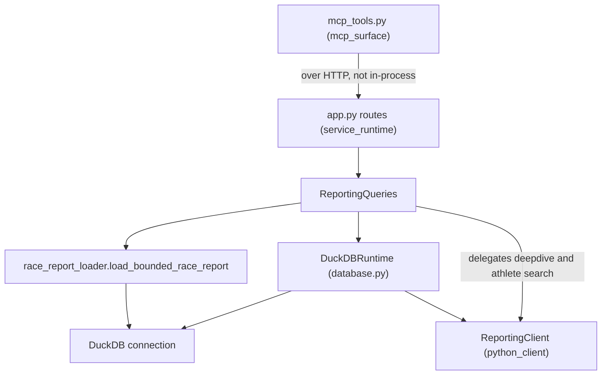
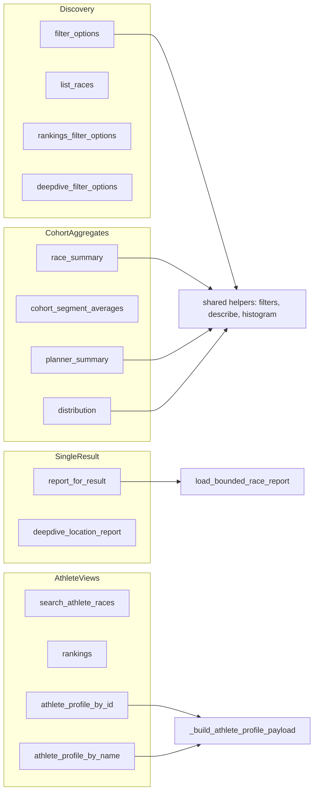
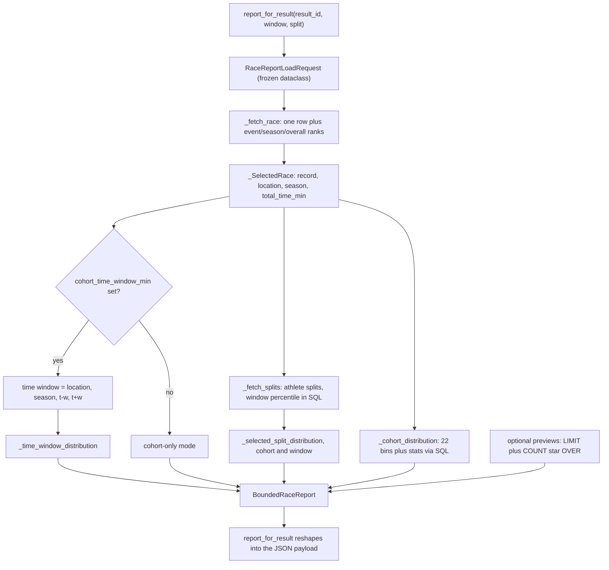

# reporting_engine

The reporting engine is the analytical core of pyrox-client: roughly 2,500 lines
across two files that turn a DuckDB artifact of HYROX race results into the
cohort statistics, distributions, rankings, and athlete profiles that every
client eventually renders. It exists because of a deliberate architectural
choice recorded in [docs/adr/0001-mcp-over-http-reporting-service.md](../docs/adr/0001-mcp-over-http-reporting-service.md):
rather than expose raw SQL (or raw rows) to LLM callers and let each one invent
its own notion of "the cohort", the service computes aggregates server-side so
that a distribution is the *same* distribution no matter who asked. That ADR is
the reason this module is large. Every question the product can answer has to be
a function here first.

Two files make up the module:

- `pyrox_api_service/reporting_queries.py` (1,856 lines) — the `ReportingQueries`
  class plus a layer of module-level helpers. This is the largest file in the
  repo and holds the query shapes, filter normalisation, and response payloads.
- `pyrox_api_service/race_report_loader.py` (666 lines) — a standalone,
  connection-injected loader that builds the single-result race report while
  keeping memory bounded. It imports nothing from the rest of the service.

Both files speak in domain nouns — Race, Result, Cohort, Distribution, Segment,
Athlete Profile — and neither knows anything about HTTP.

## Where it sits

The module has exactly one inbound caller and one outbound dependency. Routes in
[service_runtime](service_runtime.md) construct a single module-level
`ReportingQueries()` and call methods on it; database access leaves through the
`DuckDBRuntime` seam in `pyrox_api_service/database.py`. Error-to-status mapping
happens on the way back out, in `app.py`, not here.

Note the two paths to data. Most methods build SQL directly against a DuckDB
connection obtained from `self.connection()`. A few — `search_athlete_races`,
`deepdive_filter_options`, `deepdive_location_report` — delegate to the
`ReportingClient` from [python_client](python_client.md) via `self.reporting()`,
reshaping its output into an API payload. Static import analysis only sees the
`database.py` edge because `ReportingClient` is reached indirectly through the
runtime; the coupling is real all the same.

`ReportingQueries` itself is deliberately thin as an object: `__init__` stores an
optional runtime for tests, and `runtime()` falls back to `get_runtime()` per
call. That means a fresh `DuckDBRuntime` — and via `connection()`, a fresh
`ReportingClient` and DuckDB connection — is created on **every**
`self.connection()` call, not once per process. The repo's curated notes flag
per-request connection construction as an unresolved performance suspect;
reading the code, it is worse than per-request in methods that call
`self.connection()` more than once (for example `athlete_profile_by_name` opens
one connection to resolve the athlete id, then `_build_athlete_profile_payload`
opens another).

## The shared vocabulary

Before the query families make sense, five concepts recur throughout.

**The cohort.** The engine's default cohort is the 5-tuple `(season, location,
division, gender, age_group)` — the people an athlete actually raced against in
their wave. This definition is written out repeatedly as SQL in
`race_report_loader.py` (`_fetch_race`, `_cohort_distribution`,
`_cohort_preview`, `_cohort_splits_preview`, `_selected_split_distribution`),
always joined with `IS NOT DISTINCT FROM` rather than `=` so that a NULL age
group still matches a NULL age group instead of silently dropping the row. Other
query families take a looser view: `distribution()` scopes by division + gender +
optional season/age_group/location, and `_compute_profile_metric_percentile` uses
only `{division, gender}` (spelled out in `_PROFILE_PERCENTILE_COHORT_COLUMNS`)
so a profile percentile is a historical, all-time comparison. These are three
different cohort definitions living in one module; the ADR's "cohort definition
lives in exactly one place" is true relative to *clients*, not literally true
within this file.

**Filters and their normalisation.** `normalize_optional_text` reduces an
optional string to stripped text or `None`, and is the gate before nearly every
optional filter. Case-insensitivity is handled by comparing `lower(column) = ?`
against a `casefold()`-ed parameter. The one genuine domain rule is gender:
`_gender_filter` encodes that the database has historically stored both
`m`/`male` and `f`/`female`, so a request for either matches both. That helper is
used by `list_races`, `race_summary`, `cohort_segment_averages`,
`rankings_filter_options` and `rankings` — but `filter_options`,
`planner_summary`, and `distribution` each re-implement the same if/elif chain
inline instead of calling it. Three copies of one domain rule is the clearest
duplication in the module and a good first cleanup for anyone touching it.

`_normalize_profile_division_filter` deserves a specific correction: despite the
name and the surrounding narrative, it currently does nothing but
`return normalize_optional_text(value)`. It encodes no division-specific rule
today. Treat it as a named seam reserved for future division aliasing (mapping
"Open"/"open"/"HYROX Open" onto one value, say) rather than as existing logic.
The division domain rule that *does* exist lives in
`_build_athlete_profile_payload`: when a caller supplies no division filter and
the athlete has raced in more than one division, the profile-level `division`
field is set to `None` rather than borrowing the most recent race's value,
because presenting a single division would imply comparability the data does not
support.

**Segments and splits.** `SEGMENT_CONFIG` is the canonical ordered list of the 17
timed segments (total, 8 runs, 8 stations) with a display label and a group of
`overall`/`runs`/`stations`. It is imported and re-exported by `app.py`, so it is
effectively part of the service's public vocabulary. Two adjacent maps translate
friendlier keys onto columns: `_PROFILE_TIME_COLUMN_MAP` (used by profiles) and
`_DISTRIBUTION_METRIC_COLUMN_MAP` (the profile map plus `run1`..`run8`, used by
`_resolve_distribution_metric`). "Split" refers to the same idea as read from the
`split_percentiles` table rather than from wide `race_results` columns;
`_normalize_split_key` strips a label down to lowercase alphanumerics so
`"Ski Erg"` and `"skierg"` land on the same key.

**Percentiles.** The convention throughout is *1.0 = fastest*, computed as
`1.0 - (rank - 1) / (n - 1)` with a single-member cohort special-cased to `1.0`.
This exact formula appears in at least four places: `_build_histogram`,
`_distribution` in the loader, the SQL of `_fetch_splits`, and
`_compute_profile_metric_percentile`. Only the last clamps its result into the
`[0, 1]` range.

**Data-quality floors.** Run times below one minute are treated as parse
artifacts and dropped before any statistic is computed. `_min_value_for_segment`
applies this to columns named `run*_time_min`; the loader applies the same rule
inline in `load_bounded_race_report` as `1.0 if ... startswith("run")`. There is
a third implementation, `_min_value_for_split`, which is **dead code** — defined
at `reporting_queries.py:292` and called from nowhere in the repo.

## Query families

Organising the roughly thirty top-level components by what they answer rather
than alphabetically:

**Discovery / filter metadata.** `filter_options` returns the distinct seasons,
years, divisions, genders, locations, and age groups available under an optional
season/division/gender scope — six separate `SELECT DISTINCT` round-trips sharing
one WHERE clause. `list_races` groups to `(event_name, event_id, location,
season, year)` with participant counts. `rankings_filter_options` narrows age
groups and locations for a rankings cohort; note the small asymmetry that its
age-group query intentionally ignores the age-group filter (you need the full
list to populate a dropdown) while the location query applies it.
`_clean_distinct_values` and `_clean_distinct_numbers` do the tidying, and both
are written to tolerate stale or partial database artifacts by skipping
unparseable values rather than failing the whole response.

**Cohort aggregates.** `race_summary` pulls one race's rows and describes every
segment in `SEGMENT_CONFIG` plus the three aggregate columns (`run_time_min`,
`work_time_min`, `roxzone_time_min`). Its `top_percentile` parameter filters to
the fastest N% by taking the quantile of `total_time_min` at `p/100` and keeping
rows at or below it — lower time is faster, so "top 10" means `quantile(0.10)`.
`cohort_segment_averages` answers the adjacent question by *rank* rather than
percentile: order by total time, take `top_n` or `bottom_n` (mutually exclusive),
and report runs and stations separately plus a mean-of-means in
`group_averages`, which the docstring says is shaped so an LLM can compare pacing
across segments directly. `planner_summary` is the free-form one: any combination
of season, location, year, division, gender, and a total-time band, returning a
histogram and stats per segment.

`distribution()` is the endpoint the ADR specifically called out as new. It
returns one metric's histogram for a cohort, and it carries two behaviours worth
knowing: division defaults to `"open"` when unspecified, and season defaults to
`max(season)` *within the already-filtered cohort* — a second query issued before
the season clause is appended. It is also the only place in the module that
applies small-sample protection: below `DISTRIBUTION_SMALL_SAMPLE_MIN_N` (30)
valid values, `p10` and `p90` are nulled out and a `note` explains why, while the
histogram itself is kept. `race_summary`, `planner_summary`, and the race report
have no equivalent guard, so a two-person cohort there yields a confident-looking
p10/p90.

**Rankings.** `rankings` computes `ROW_NUMBER()` placement over the whole
season/division/gender/age-group cohort in a CTE and only then applies the
optional name filter, so a searched athlete keeps their true global placement
rather than being renumbered within the search results. `target_time_min` answers
"where would a 75-minute finish place?" with two counting queries (strictly-less
and exactly-equal). One thing to watch when reading the payload: `count` is the
size of the full cohort, not the number of returned rows, even when a name filter
narrowed the result set.

**Athlete profile.** `athlete_profile_by_id` and `athlete_profile_by_name` both
funnel into `_build_athlete_profile_payload`. The by-name path resolves distinct
`athlete_id`s via `athlete_results` and raises `ReportingConflictError` (409) on
ambiguity instead of guessing — callers are told to resolve an athlete id through
athlete search and retry. The payload builder assembles identity fields, summary
stats, per-metric personal bests, average times, per-year progression, and a
per-race metric block from `_PROFILE_RACE_PROGRESS_COLUMNS`.
`_build_profile_metric_series` adds one derived metric, `runplusroxzone`,
computed only where both source columns are present and positive.

Profiles are also where the module's schema-tolerance shows up.
`_load_race_results_columns` reads `PRAGMA table_info('race_results')` and the
profile code branches on what it finds: `_load_profile_rows_for_athlete_id` only
runs the age-group-rank window-function CTE when all six ranking columns exist,
otherwise it falls back to a plain join with `CAST(NULL AS INTEGER) AS
age_group_rank`. Similarly `_compute_profile_metric_percentile` returns `None` —
treated as absent optional enrichment, not an error — when required columns are
missing or the query throws. The stated motivation is fixture and
older-artifact compatibility; whether any *production* artifact is actually
missing those columns I could not verify from the code alone.

Be aware of the cost shape here: for every metric,
`_build_athlete_profile_payload` issues one percentile query **per race** to
build the average percentile, plus one more for the personal best. An athlete
with 10 races across 10 metrics is on the order of 110 aggregate queries against
the full `race_results` table. This is the one place in the module where the
query count grows multiplicatively with input size, and it stands in sharp
contrast to the care taken in the race-report loader.

## The bounded race-report loader

`report_for_result` is the endpoint behind the production incident the repo's
notes describe (the race report hanging past 120 seconds), and
`race_report_loader.py` is the fix. The design principle, stated in the one-line
docstring of `load_bounded_race_report`, is to "load one report without
materializing unrequested cohort rows".

The mechanism is that **statistics are computed inside DuckDB, and only the
statistics cross into Python**. `_distribution` takes an arbitrary `values_sql`
CTE and wraps it in a query that computes count/min/max/mean/median/p10/p90 and a
bucket-index-to-count grouping in SQL. What comes back is at most 22 rows (one
per histogram bin) regardless of whether the cohort is 30 athletes or 30,000.
Bucketing is done arithmetically — `FLOOR(((value - min) / (max - min)) * bins)`
clamped with `LEAST(..., bins - 1)` — and the bin edges are reconstructed in
Python with `np.linspace`. The athlete's own percentile comes from a
`COUNT(*) FILTER (WHERE value < ?)` in the same pass, so no ranking scan is
needed on the client side.

Row previews follow the same discipline through `PreviewData`: the SQL carries
`COUNT(*) OVER () AS __total` alongside a `LIMIT ?`, so the caller learns the
true cardinality while only `limit` rows are transferred. `_preview` strips the
`__total` column back out before serialising. Crucially, previews are *opt-in* —
`report_for_result` passes `cohort_preview_limit` and
`cohort_splits_preview_limit` as `None` unless the caller set `include_cohort` or
`include_cohort_splits`, and the loader skips those queries entirely when they
are `None`.

The loader's return type, `BoundedRaceReport`, is a frozen dataclass of nine
fields whose optionality directly mirrors what the caller asked for:
`time_window`, `selected_split_cohort`, `selected_split_time_window`, and the
three preview fields are all `Optional`. `report_for_result` then does the
shaping — nesting `selected_split` under `distributions`, computing the two chart
payloads (`_build_work_vs_run_split` and `_build_run_change_series`), and logging
elapsed time. The chart helpers are the only part of the race report that still
works row-by-row in pandas, and they only ever see the single athlete's own row
and their own splits, so they are inherently bounded.

`_build_run_change_series` is worth one note of its own: it reports each of runs
2 through 7 as a delta from the median of *that athlete's* runs 2 through 7,
resolving each run from the wide `race_results` column first and falling back to
the split rows via `_build_split_time_map`. Missing runs stay as `None` so the
chart keeps a stable x-axis. Runs 1 and 8 are excluded, presumably because the
first and last runs have different pacing characteristics — that rationale is my
inference, not something the code states.

One asymmetry to be aware of: when `cohort_time_window_min` is `None`,
`_fetch_splits` takes an early-return branch that returns the stored
`split_percentiles` rows as-is, without the `split_percentile_time_window` column
that the windowed branch adds. Downstream consumers should treat that field as
possibly absent rather than merely possibly null. Also, `season` is defaulted to
`0` when the selected race has no season and no time window was requested; it is
unused on that path, but it is a sentinel rather than a null and could surprise
someone extending the function.

## Two histogram implementations

The module computes histograms two different ways, and they are not shared code.
`_build_histogram` in `reporting_queries.py` uses `np.histogram` over a
materialised pandas Series and is used by `planner_summary` and `distribution`.
`_distribution` in `race_report_loader.py` does the equivalent arithmetic in SQL
and is used only by the race report. Both default to 22 bins (`bins: int = 22`
versus `HISTOGRAM_BINS = 22`), both widen a degenerate `min == max` range by 1.0,
and both use the same percentile formula, so outputs should agree — but binning
edge semantics differ slightly (NumPy folds the rightmost edge into the last bin;
the SQL clamps with `LEAST`), and I found nothing in the test suite that pins the
two implementations to each other. If you change bin count or bucketing, change
both.

`_describe_times`, `_describe_series`, and `_describe_clean_series` are the
corresponding pandas-side summary helpers; the loader's SQL `stats` CTE is their
in-database twin, down to the same seven keys.

## Errors

The module defines its own small taxonomy and lets `app.py` translate it:
`ReportingQueryError` (400) as the base, `ReportingNotFoundError` (404), and
`ReportingConflictError` (409), each carrying a `status_code` class attribute
that `app.py`'s `_raise_http` reads. Unexpected failures are deliberately *not*
caught here — they bubble to the adapter. The one piece of string-matching glue
is `_is_missing_result_error`, which detects `ValueError`s beginning with
`"result_id not found:"` (raised by `_fetch_race`, and by `ReportingClient` on
the deepdive path) and re-raises them as 404s. That coupling is fragile: changing
the message text in `race_report_loader._fetch_race` would silently downgrade a
404 into a 400.

## Reading order for a new maintainer

Start with `_gender_filter` and `normalize_optional_text` to learn how filters
are built, then read `distribution()` end to end — it is the smallest complete
example of the cohort, filter, histogram, stats pipeline. Then read
`load_bounded_race_report` top to bottom with `_distribution` open beside it;
that pair is where the module's real engineering lives. Leave
`_build_athlete_profile_payload` for last. Before adding a new question type,
re-read [docs/adr/0001-mcp-over-http-reporting-service.md](../docs/adr/0001-mcp-over-http-reporting-service.md):
new question shapes are supposed to arrive as new methods here (plus a new route
in [service_runtime](service_runtime.md), and possibly a tool in
[mcp_surface](mcp_surface.md)), not as prompt changes or ad-hoc SQL.

Consumers of what this module returns are documented in
[ui_data_and_charts](ui_data_and_charts.md) and [ui_modes](ui_modes.md); the
shell that hosts them is [ui_shell](ui_shell.md).
