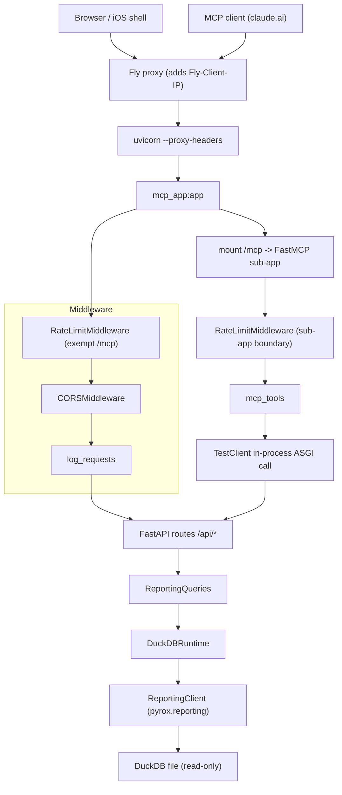
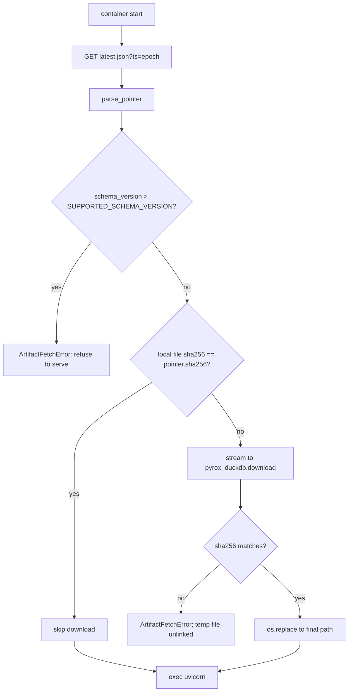

# service_runtime

`service_runtime` is the HTTP face of Pyrox and the plumbing that keeps it
standing up. It is a small FastAPI application (`pyrox_api_service/app.py`)
that declares fifteen read-only JSON endpoints under `/api/*`, plus three
supporting pieces: a DuckDB configuration seam (`database.py`), a per-client-IP
edge rate limiter (`ratelimit.py`), and a boot-time artifact downloader
(`fetch_db.py`). The module exists to keep transport concerns — routing, query
parameter validation, CORS, request logging, and exception-to-status-code
mapping — in one place, so that the analytics themselves can live as plain
Python in [reporting_engine](reporting_engine.md) and be reused unchanged by
[mcp_surface](mcp_surface.md). The service runs on Fly.io at
`pyrox-api.fly.dev`, scale-to-zero, with the ~1.16GB DuckDB file parked on a
persistent volume.

The important thing to understand up front: **this module holds no data logic at
all.** `app.py`'s route handlers are one-liners that forward keyword arguments
to a `ReportingQueries` instance and let a shared helper translate exceptions.
If you are looking for what a number means, you are in the wrong file.

## The composed application

The deployed ASGI object is *not* `pyrox_api_service.app:app` — it is
`pyrox_api_service.mcp_app:app`, which imports the FastAPI app from this module,
mounts a FastMCP streamable-HTTP sub-app at `/mcp`, and replaces the router's
lifespan context. So `app.py` defines the app, and
[mcp_surface](mcp_surface.md) decorates it. One deploy, two protocols.



Note the loop in that diagram: an MCP tool call re-enters the same REST routes
through an in-process `TestClient`, so MCP traffic gets the same validation,
defaults, and error mapping as a browser request. That is why the rate limiter
needs the exemption rule described below.

## Middleware order and why it is that order

Middleware is added in `app.py` in this sequence:

1. `RateLimitMiddleware` with `exempt_path_prefixes=("/mcp",)`
2. `CORSMiddleware` with an origin allow-list from `PYROX_API_ALLOW_ORIGINS`
3. `log_requests`, an `@app.middleware("http")` function

Starlette applies middleware outermost-last, so the rate limiter ends up
*inside* CORS. The inline comment states the intent explicitly: a 429 must still
pass back out through `CORSMiddleware` so a browser can actually read the
response body instead of seeing an opaque CORS failure.

`log_requests` emits one line before the handler (`request GET /api/...`) and one
after, including status code and elapsed seconds at 3dp. Logging is configured
at module import via `logging.basicConfig(level=INFO)` under the logger name
`pyrox.api` — the same logger name [reporting_engine](reporting_engine.md) uses,
so query timings and request timings interleave in one Fly log stream.

`DEFAULT_ORIGINS` covers local Vite plus the Capacitor/Ionic schemes the iOS
shell uses; production overrides it in `fly.toml`. The allow-list is logged at
boot, which is a handy first check when the frontend gets CORS errors.

## Routes

Every route is a `GET`, returns `dict`, and delegates through `_query(...)`.
Path and query validation is declarative — FastAPI `Query(...)` constraints do
the bounds checking before the handler body runs, so a `bins=500` request is
rejected with a 422 without ever touching DuckDB.

| Path | Handler symbol | Delegates to `queries.` | Notable constraints |
| --- | --- | --- | --- |
| `/api/health` | `healthcheck` | `healthcheck` | none; see caveat below |
| `/api/athletes/search` | `search_athlete_races` | `search_athlete_races` | `name` min length 1, `limit` 1–5000, `require_unique` defaults true |
| `/api/filter-options` | `filter_options` | `filter_options` | all optional |
| `/api/races` | `list_races` | `list_races` | all optional |
| `/api/race-summary` | `race_summary` | `race_summary` | `season` and `location` required, `top_percentile` strictly 0–100 |
| `/api/cohort-segment-averages` | `cohort_segment_averages` | `cohort_segment_averages` | `top_n` / `bottom_n` both optional, both ≥1 |
| `/api/reports/{result_id}` | `report_for_result` | `report_for_result` | `cohort_limit` ≤5000, `cohort_splits_limit` ≤10000, cohort payloads off by default |
| `/api/deepdive/filters` | `deepdive_filter_options` | `deepdive_filter_options` | `season` required |
| `/api/deepdive/{result_id}` | `deepdive_location_report` | `deepdive_location_report` | `bins` 5–80, `metric` defaults `total_time_min` |
| `/api/planner` | `planner_summary` | `planner_summary` | everything optional except `bins` 5–80 |
| `/api/distribution` | `distribution` | `distribution` | `gender` required, `metric` defaults `overall` |
| `/api/rankings/filters` | `rankings_filter_options` | `rankings_filter_options` | `season`, `division`, `gender` all required |
| `/api/rankings` | `rankings` | `rankings` | `limit` 1–2000, `target_time_min` > 0 |
| `/api/athletes/{athlete_id}/profile` | `athlete_profile_by_id` | `athlete_profile_by_id` | optional `division` |
| `/api/athletes/profile` | `athlete_profile` | `athlete_profile_by_name` | exact name match |

Two ordering details are load-bearing and easy to break during a refactor.
`/api/deepdive/filters` is declared *before* `/api/deepdive/{result_id}`; both
are three-segment paths, and FastAPI matches in declaration order, so swapping
them would route `filters` into the report handler as a result id. The athlete
routes look similar but are safe — `/api/athletes/profile` has three segments
and `/api/athletes/{athlete_id}/profile` has four, so they cannot collide.

`app.py` also re-exports `SEGMENT_CONFIG` and `DISTRIBUTION_SMALL_SAMPLE_MIN_N`
from `reporting_queries` using the explicit `X as X` re-export form. Nothing in
the service imports them from here; the only consumer found is
`tests/test_api.py`, which reaches them as `api.SEGMENT_CONFIG`. Treat these as
a test-facing convenience, not a public surface.

## Error mapping

`_raise_http(exc)` is the single translation table from domain exception to HTTP
status:

- `DatabaseConfigurationError` → **500**, with the real cause written to the log
  and a flat `"internal server error"` returned to the client. The comment says
  this is deliberate: the exception message embeds the DuckDB filesystem path.
- `AthleteNotFound` (from `src/pyrox/errors.py`, owned by
  [python_client](python_client.md)) → **404**.
- `ReportingQueryError` → the status code the exception itself carries
  (`exc.status_code`), which lets [reporting_engine](reporting_engine.md) pick
  409/422/etc. without knowing about FastAPI.
- Bare `ValueError` → **400**.
- Anything else re-raises unchanged, becoming a 500 with a traceback in the log.

`_query(call, *args, **kwargs)` wraps a callable in `try/except` and funnels
failures into `_raise_http`. Because `_raise_http` always raises, `_query`'s
implicit `return None` on the exception path is unreachable — worth knowing if a
type checker complains about it.

The `healthcheck` handler notably does **not** go through `_query`. It catches
broadly and branches on `DatabaseConfigurationError`, but both branches raise the
identical `HTTPException(500, detail=str(exc))`. The branch is dead code, and
more importantly the health path returns `str(exc)` verbatim — the very path
leak that `_raise_http` goes out of its way to suppress everywhere else. The
success payload does the same thing on purpose: `healthcheck()` in
`reporting_queries.py` returns `{"status": "ok", "database": <absolute path>,
"tables": [...]}`. On a public endpoint that discloses `/data/pyrox_duckdb` and
the full table list. Whether that is an accepted trade for operability or an
oversight is not documented anywhere I found; flagging it as an open question
rather than asserting either way.

## Rate limiting

`ratelimit.py` is 68 lines and carries more design reasoning in its docstring
than code. The exposure it defends: every reporting call runs a DuckDB scan over
a multi-gigabyte artifact, and `/mcp` is public, unauthenticated, and reachable
by agent loops.

The implementation is a **pure-ASGI** middleware over the `limits` library
(`MovingWindowRateLimiter` on `MemoryStorage`), not `slowapi`'s
`SlowAPIMiddleware`. The docstring gives two reasons: `SlowAPIMiddleware` binds
to route endpoints, which is unreliable across a mounted ASGI sub-app, and it
raises `AttributeError` on the request-exempt path this service needs. Staying
pure-ASGI also means allowed requests are forwarded untouched, so the MCP
transport's streaming responses are never buffered.

Two exemptions exist, and they are different in kind:

**Path exemption.** The outer app is constructed with
`exempt_path_prefixes=("/mcp",)`, so nothing under `/mcp` is charged at the REST
boundary. The stated reason is that `/mcp` triggers a redirect to `/mcp/`, and
without the exemption a single MCP call would burn two tokens. MCP traffic is
instead limited by a second `RateLimitMiddleware` added to the sub-app in
`mcp_app.py`. Both use the *same* module-level `_limiter` and `_rate` globals, so
one client's REST and MCP calls share a single per-IP window.

**Header exemption.** `__call__` reads the `fly-client-ip` header from the raw
ASGI scope. If it is absent, the request passes through unlimited. This is how
in-process traffic escapes: `mcp_tools` calls the REST app through a
`TestClient`, and the test suite does the same, neither of which carries a Fly
header. Without this, all in-process calls would key against a shared bucket and
throttle each other. The correctness of this rests on Fly's proxy always adding
the header on inbound traffic — I did not verify that against Fly's
documentation, only against the code comment.

No `/api/*` route is exempt, including `/api/health`. An uptime monitor polling
health more than `PYROX_RATE_LIMIT` allows will get 429s like anyone else.

The rate defaults to `60/minute` and is read from `PYROX_RATE_LIMIT` **once at
import time** into a module global. Changing it requires a restart. Because
storage is `MemoryStorage`, the window is per-process: it resets on every cold
boot (frequent, given scale-to-zero) and would not be shared if Fly ever ran more
than one machine. For a public read-only service that is a reasonable trade, but
it means the limit is a cost guardrail rather than a hard guarantee. Operational
detail lives in `docs/maintainers/reporting-service.md`.

## The DuckDB seam

`database.py` is the module's most deliberate piece of design, and its docstring
says why: it "deliberately models the concrete DuckDB runtime instead of a
generic database abstraction, because DuckDB is the only production adapter
today." There is no `AbstractDatabase`. There is a frozen dataclass,
`DuckDBRuntime`, holding exactly one field — `database_path`.

`resolve_database_path(raw=None, cwd=None)` does the resolution: it takes an
explicit path or falls back to `PYROX_DUCKDB_PATH`, then `pyrox_duckdb`. The
literal `":memory:"` passes through untouched; anything else is expanded,
made absolute against `cwd` (defaulting to the process working directory), and
checked for existence. A missing file raises `DatabaseConfigurationError`, which
`_raise_http` turns into a logged-but-redacted 500.

`DuckDBRuntime` exposes three operations: `reporting_client()`, `connection()`,
and `list_tables()`. `get_runtime()` is the module-level factory used by
request handling.

### The ReportingClient relationship

This is the architecturally significant part. The service does **not** own a
DuckDB driver. `DuckDBRuntime.reporting_client()` constructs
`ReportingClient(database=self.database_path)` — the same class shipped in the
public client library at `src/pyrox/reporting.py`, owned by
[python_client](python_client.md). `connection()` then reaches through it to
`ReportingClient._ensure_connection()`, a private method, to get the raw DuckDB
handle for queries that have no `ReportingClient` equivalent yet.

Two consequences follow.

First, the read-only guarantee is inherited, not enforced here.
`_ensure_connection()` computes `read_only = self.database != ":memory:"` and
calls `duckdb.connect(path, read_only=read_only)`. The service gets a read-only
file handle because the client library decided so. Nothing in `database.py`
would stop that changing.

Second, constructing a `ReportingClient` also constructs a `PyroxClient`
(`self.client = client or PyroxClient()`), the CDN-backed HTTP client the
library uses to fetch race manifests. In the service that half is entirely
unused — the API only ever reads local DuckDB. `PyroxClient.__init__` only
builds a `CacheManager` over a cache directory, so it is cheap and does no
network I/O at construction; but it is a real dependency edge that means the
service pulls in httpx-based client code it never calls. I read both
constructors to confirm there is no eager network call.

Third, and worth calling out: neither `DuckDBRuntime` nor `ReportingQueries`
caches anything. `ReportingQueries.runtime()` calls `get_runtime()` on every
access when no runtime was injected, and `reporting_client()` builds a fresh
`ReportingClient` — hence a fresh `duckdb.connect` — each time. The
`DuckDBRuntime` docstring says "it does not cache connections itself;
`ReportingClient` keeps the connection lifecycle," which is true of a single
client instance but does not amount to cross-request reuse given a new instance
per call. DuckDB connections to an existing file are cheap to open, so this may
well be fine in practice; I have not profiled it and am reporting the shape, not
a verdict.

The seam's payoff is testability: `ReportingQueries(DuckDBRuntime(database_path=
tmp_db))` swaps the entire data layer with no monkeypatching, which is exactly
what `tests/test_reporting_runtime.py` does.

## Boot: fetching the artifact

`fetch_db.py` runs as a container entrypoint step, before uvicorn:

```
python -m pyrox_api_service.fetch_db && exec uvicorn pyrox_api_service.mcp_app:app ...
```

The data is built elsewhere — the `hyrox_analysis` repo's scraping pipeline
publishes an immutable DuckDB object to S3/CloudFront alongside a `latest.json`
pointer. This service never ingests or writes data; it only consumes the
published artifact.



The pointer contract is a frozen `ArtifactPointer` dataclass:
`key`, `sha256`, `size_bytes`, `schema_version`, `built_at`. `parse_pointer`
requires the first four (`built_at` defaults to `""`).

`SUPPORTED_SCHEMA_VERSION = 1` is the forward-compatibility brake. If the
pipeline publishes a pointer with a higher `schema_version`, boot fails loudly
with "upgrade the service before serving it" rather than the API silently
returning wrong shapes against a schema it does not understand. Note the
asymmetry: only *newer* is refused. An older artifact is accepted without
comment.

Three details in `fetch_artifact` are worth knowing:

- The pointer request appends a `ts=<epoch>` cache-buster, because a
  CDN-cached `latest.json` could otherwise pin a restarting machine to a stale
  artifact indefinitely.
- The skip path hashes the *existing local file* to compare against the pointer.
  On a 1.16GB file that is real I/O on every boot, but it is what makes the
  persistent volume pay off.
- The download is streamed to `<target>.download`, verified, then `os.replace`d
  into place — an atomic swap, so a killed boot never leaves a half-written
  database where the API would find it. The `finally: tmp_target.unlink(
  missing_ok=True)` is a no-op on the success path (the file has already been
  renamed away) and the actual cleanup on the mismatch path.

`artifact_url` resolves the bucket-root-relative key against the pointer URL's
own scheme and host, so pointing `PYROX_DB_POINTER_URL` at a different CDN or a
local mirror moves the artifact fetch with it.

Env vars and the local-run recipe are in
`docs/maintainers/reporting-service.md`; deploy runbooks are under
`docs/maintainers/`.

## Deployment shape

`fly.toml` and `Dockerfile` together explain the boot behaviour:

- **Scale to zero.** `min_machines_running = 0`, `auto_stop_machines = "stop"`,
  `auto_start_machines = true`. The machine sleeps when idle and wakes on the
  next request, which is why cold-boot cost matters so much.
- **Persistent volume.** `[mounts]` maps `pyrox_data` to `/data`, and
  `PYROX_DUCKDB_PATH = /data/pyrox_duckdb`. The comment records the failure this
  fixed: without a volume the rootfs was wiped on every stop, every cold boot
  re-downloaded ~1.16GB (~5 min), and Fly's auto-stop killed the machine
  mid-download before uvicorn could bind — a boot loop. With the volume,
  `fetch_db`'s sha256 skip logic reuses the file and cold boots take seconds.
  The volume must be created once by hand before the first deploy.
- **Proxy headers.** uvicorn runs with `--proxy-headers --forwarded-allow-ips
  '*'` so it trusts Fly's `X-Forwarded-Proto`. The comment explains why this is
  not cosmetic: without it the `/mcp` → `/mcp/` mount redirect downgrades to
  `http`, and MCP clients such as claude.ai abort and fall into a failing OAuth
  fallback.
- **No baked data.** The Dockerfile installs the package with the `[api]` extra
  and copies source only; the DuckDB file is fetched at boot, so a data refresh
  never needs an image rebuild.
- **MCP DNS-rebinding protection is off by default**, with a long comment in
  `fly.toml` explaining that it protects localhost-bound servers from browser
  pivots and only breaks legitimate browser/Electron MCP clients here. Setting
  `PYROX_MCP_ALLOWED_HOSTS` re-enables it. That switch is read in
  [mcp_surface](mcp_surface.md), not this module.

The `PYROX_DUCKDB_PATH` default appears in three places — `database.py`
(`DEFAULT_DB_PATH`), `fetch_db.py`'s fallback, and `Dockerfile`'s `ENV` — with
`fly.toml` overriding to `/data/pyrox_duckdb`. They currently agree; they are
not derived from a single constant, so they can drift.

## Legacy shim

`src/pyrox/api/app.py` still exists and does `from pyrox_api_service.app import
*` plus an explicit `app` re-export. It is a compatibility shim for the old
module path, documented as such in its own docstring. Nothing in the current
service or Dockerfile imports it. Deleting it is a call about external
consumers, not about this module.

## Where to look next

- Query shapes, payload fields, and every number the API returns:
  [reporting_engine](reporting_engine.md) (`pyrox_api_service/reporting_queries.py`).
- The `/mcp` mount, tool registration, and the in-process `TestClient` bridge:
  [mcp_surface](mcp_surface.md).
- `ReportingClient`, `PyroxClient`, and `AthleteNotFound`:
  [python_client](python_client.md).
- Who calls these routes from the browser: [ui_data_and_charts](ui_data_and_charts.md)
  and [ui_shell](ui_shell.md).
- Env vars, local run, deploy, and rate-limit tuning:
  `docs/maintainers/reporting-service.md`.
- Behaviour that is actually pinned by tests: `tests/test_api.py`,
  `tests/test_ratelimit.py`, `tests/test_fetch_db.py`,
  `tests/test_reporting_runtime.py`.
