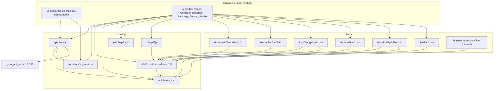

# ui_data_and_charts

Everything in this module sits between the HTTP wire and the pixels. It is the
shared foundation the rest of the UI is built on: one HTTP client that knows how
to talk to `pyrox_api_service`, a handful of pure functions that turn raw
numbers into strings a human can read, a constants file that encodes the HYROX
vocabulary (runs, stations, roxzone, divisions), and seven presentational chart
components. Static import analysis puts the module's outbound dependency count
at zero — nothing here imports from [ui_shell](ui_shell.md) or
[ui_modes](ui_modes.md) — and I confirmed that by reading every import statement
in the thirteen files. The dependency arrows all point inward: all six page
modes and the app shell consume this module, and it consumes nothing but npm
packages and itself.

That shape is the whole point: because none of these files know which page is
rendering them, they can be reasoned about and tested in isolation. The test
suite reflects it — `ui/src/__tests__/utils/{formatters,parsers}.test.js` plus
one test file per chart under `ui/src/__tests__/charts/` cover this module
directly, while the page-mode tests mock the charts and `api/client.js` away.

---

## Part one: the data layer

### The HYROX vocabulary — `constants/segments.js`

Despite the filename this file does two unrelated jobs, and the name hides half
of it. The first half is environment and app config: `resolveApiBase()`,
`API_BASE`, `VALID_MODES`, `IOS_MOBILE_MEDIA_QUERY`, `isIosBrowserDevice()`,
`getInitialMode()`. The second half is the race vocabulary. They share a file by
accident of history as far as I can tell — there is no code reason for it.

`resolveApiBase()` is the only piece of platform-awareness in the data layer. It
prefers `VITE_API_BASE_URL` from the Vite env if set; otherwise it asks Capacitor
which platform it is on and hardcodes `http://10.0.2.2:8000` for Android (the
emulator's alias for the host loopback) and `http://127.0.0.1:8000` for iOS;
otherwise it derives `http://<current hostname>:8000` from `window.location`;
otherwise `http://localhost:8000`. The result is frozen into the `API_BASE`
constant at module load, so changing the API host at runtime is not possible
without a reload. `App.jsx` imports `API_BASE` to run a `/api/health` probe
through `useAppBootstrap`; `client.js` imports it to build every request URL.

`VALID_MODES` is the set `{report, compare, deepdive, rankings, planner,
profile}` — the six page modes of [ui_modes](ui_modes.md) — and `App.jsx` uses
it to validate whatever mode string comes out of the URL or storage.
`getInitialMode()` currently just returns the string `"profile"` unconditionally;
it looks like a seam left in place for a smarter default that was never written.

The race vocabulary is the interesting part, and it is the shared language
between the UI, the API, and the DuckDB tables underneath. A HYROX race is eight
runs interleaved with eight work stations, plus the transitions:

- **`RUN_SEGMENTS`** — nine entries: `run1` through `run8`, then `roxzone`. The
  roxzone is the transition area between a run and its station; the time spent
  there is real race time that belongs to neither the run nor the station, so it
  is modelled as a ninth "run" segment. It is given a distinct orange (`#f97316`)
  where the eight runs are all blues, which reads as a deliberate visual signal
  that it is a different kind of thing.
- **`STATION_SEGMENTS`** — the eight work stations in race order: SkiErg, Sled
  Push, Sled Pull, Burpee Broad Jump, RowErg, Farmers Carry, Sandbag Lunges,
  Wall Balls.

Every segment entry has the same four fields, and the shape is what makes the
vocabulary work: `key` is the normalised lowercase identifier (`"burpeebroadjump"`),
`label` is the human string (`"Burpee Broad Jump"`), `color` is the chart hex,
and `column` is the exact database/API column name (`"burpeeBroadJump_time_min"`).
That `key`/`column` pair is the join: `key` matches what `normalizeSplitKey()` in
`parsers.js` produces from an API split name, and `column` matches what appears
on a flat race row. A single segment object therefore lets a caller look a value
up either way, which is exactly what `pickSegmentValue()` does.

The derived exports build on those two lists rather than restating them:
`DEEPDIVE_METRIC_OPTIONS` prepends four aggregate metrics (`total_time_min`,
`work_time_min`, `run_time_min`, `roxzone_time_min`) and then maps the runs
(excluding roxzone, since it is already in the aggregates) and stations into
`{value: column, label}` dropdown options. `RUN_PERCENTILE_SEGMENTS` and
`STATION_PERCENTILE_SEGMENTS` strip each list down to `{key, label}` for the
percentile chart, which does not need colours or columns. `DEEPDIVE_STAT_OPTIONS`
is a small hand-written list — Top 5% / Podium / Mean / Bottom 10% — mapping to
`p05`, `podium`, `mean`, `p90`.

The `result_id` concept does not appear in this file but is central to the
client below: it identifies one athlete's one race result and is the key into
both the report and deepdive endpoints. See
[docs/data-model.md](../docs/data-model.md) for the authoritative definition.

### The REST seam — `api/client.js`

This file owns the entire HTTP surface of the UI. Every network call in the app
goes through `apiFetch()`, which builds a `URL` from `API_BASE` plus a path,
appends only the params that are not `undefined`/`null`/empty string, and wires
an `AbortController` to a timeout. On a non-2xx response it throws an `Error`
whose message comes from `parseError()`; on an abort it converts the
`AbortError` into a friendlier `"Request timed out after Ns. Please try again."`.
The `AbortController` is feature-detected, so in an environment without one the
call simply runs untimed.

Timeouts are tiered by workload in a `REQUEST_TIMEOUT_MS` table: 15s default,
20s for searches and filter lookups, 45s for profiles, 60s for rankings and
planner, 90s for reports and deepdives — a decent rough map of which queries are
expensive on the DuckDB side (see [service_runtime](service_runtime.md) and
[reporting_engine](reporting_engine.md)). The file also constructs and exports
the singleton TanStack `queryClient` (5-minute `staleTime`, one retry, no
refetch on window focus); `main.jsx` is its only consumer.

Each exported function maps one-to-one onto a FastAPI route. I verified every
path and parameter name against `pyrox_api_service/app.py`:

| Function | Endpoint | Notes |
| --- | --- | --- |
| `searchAthletes(name, filters)` | `GET /api/athletes/search` | Always sends `name`, `match` (default `"contains"`), and `require_unique` as a stringified boolean; `gender`, `division`, `nationality` are optional. |
| `fetchReport(resultId, options)` | `GET /api/reports/{result_id}` | Optional `cohort_time_window_min` and `split_name`. The route also accepts `include_cohort`, `cohort_limit`, `include_cohort_splits`, `cohort_splits_limit` — the client never sends any of them, so the UI always gets the server defaults. |
| `fetchDeepdive(resultId, options)` | `GET /api/deepdive/{result_id}` | Seven optional params: `season`, `metric`, `division`, `gender`, `age_group`, `location`, `stat`. Note that `season` is **required** server-side (`Query(..., ge=1)`) but optional in the client's construction — omitting it produces a 422, which surfaces as a `parseError` message rather than a client-side guard. |
| `fetchDeepdiveFilters(options)` | `GET /api/deepdive/filters` | Same required-`season` caveat. |
| `fetchFilterOptions(options)` | `GET /api/filter-options` | The generic cohort-filter lookup; `season` is genuinely optional here. Consumed by four of the six modes. |
| `fetchPlanner(filters)` | `GET /api/planner` | Seven optional filters including `min_total_time`/`max_total_time` mapped from camelCase `minTime`/`maxTime`. |
| `fetchRankingsFilters(options)` | `GET /api/rankings/filters` | Server requires `season`, `division`, and `gender`; the client sends them only when non-empty. |
| `fetchRankings(filters)` | `GET /api/rankings` | Adds `athlete_name`, `limit`, and `target_time_min`. All filter values are passed through `.trim()`, which means `limit` and `targetTime` are expected as *strings* from form state, not numbers — passing a number would throw on `.trim()`. |
| `fetchAthleteProfile(identityOrName)` | `GET /api/athletes/{athlete_id}/profile` **or** `GET /api/athletes/profile` | The one polymorphic function. A bare string is treated as a name. An object with `athleteId` routes to the id endpoint (URL-encoded) with optional `division`; an object with only `name` routes to the name endpoint. If neither is present it throws synchronously with `"athleteId or name is required."` — note this throws rather than rejecting, so a caller using `.catch()` without a `try` will not see it. |

The recurring `filters.x?.trim()` idiom means the client treats empty and
whitespace-only strings as absent, which pairs with `apiFetch()` dropping empty
values. The net effect is that form fields left blank simply do not appear in
the query string.

Five server routes have no client function at all: `/api/health` (called
directly from `useAppBootstrap` in [ui_shell](ui_shell.md), bypassing this file),
`/api/races`, `/api/race-summary`, `/api/cohort-segment-averages`, and
`/api/distribution`. Those last four are presumably exercised by the Python
client or the MCP surface — see [python_client](python_client.md) and
[mcp_surface](mcp_surface.md) — rather than the web UI.

### Parsing — `utils/parsers.js`

Five small pure functions, no dependencies:

`toNumber(value)` is the workhorse and the most subtle function in the module.
It returns `null` (never `NaN`) for anything unusable. Given a string containing
a colon it parses clock notation: `"m:ss"` becomes minutes as a float, `"h:mm:ss"`
becomes hours-times-60 plus the rest. Anything with four or more colon-separated
parts returns `null`. So the canonical internal unit throughout the UI is
**decimal minutes**, and `toNumber` is the gate that everything passes through
to get there.

`normalizeSplitKey(value)` lowercases and strips every non-alphanumeric
character, which is what produces the `key` values in `segments.js`
(`"Burpee Broad Jump"` → `"burpeebroadjump"`). `buildSplitTimeMap(splits)` turns
an API splits array into a `Map` keyed by that normalised name, with
`{name, time}` values. `pickSegmentValue(segment, race, splitMap)` is the lookup
that ties the two representations together: prefer the split map entry if it has
a finite time, otherwise fall back to `race[segment.column]` on the flat row.
`ReportMode` and `CompareMode` are the consumers.

`parseError(response)` reads a failed `Response` as JSON and returns its
`detail` field (FastAPI's error shape), falling back to `statusText` and then to
`"Request failed."`.

### Formatting — `utils/formatters.js`

At fan-in 13 this is the most depended-upon file in the repo, and it is 95 lines
of pure functions. Its only import is `toNumber`.

`formatMinutes` and `formatDurationMinutes` are near-identical: both convert
decimal minutes into `m:ss` or `h:mm:ss`, both return `"-"` for null/empty/
non-finite input. The difference is one line — `formatMinutes` clamps negatives
to zero via `Math.max(0, ...)`, while `formatDurationMinutes` takes
`Math.abs()`. That duplication is deliberate but easy to miss; the two are not
interchangeable when a value can go negative. `formatDeltaMinutes` builds on
`formatDurationMinutes` and prefixes an explicit `+` or `-`, leaving zero
unsigned.

`formatPercent` multiplies by 100 and fixes to one decimal, so it expects a
fraction in `[0, 1]`, not an already-scaled percentage. `formatLabel` is a
null-safe `String()`. `formatTimeWindowLabel` produces `"+/- N min"` or a prose
fallback. `getPercentileColorClass` buckets a 0-1 percentile into four CSS class
names (`perc-excellent` ≥ 0.90, `perc-good` ≥ 0.75, `perc-average` ≥ 0.25, else
`perc-below`); those classes are defined in `ui/src/styles/components.css` and
consumed by `ProfileMode` and `ReportMode`. `sumTimes(...values)` adds an
arbitrary number of values through `toNumber` and returns `null` if *any* of them
is unparseable — an all-or-nothing sum, so a partially-recorded race yields no
total rather than a misleadingly small one.

Note the unit asymmetry worth remembering when reading calls: `formatPercent`
takes a fraction, but `PercentileLineChart` works in already-scaled 0-100 values
and formats them with its own local helper rather than using `formatPercent`.

### Haptics — `utils/haptics.js`

Eighteen lines, one export. `triggerSelectionHaptic()` registers a Capacitor
plugin named `"Haptics"` and calls `selectionChanged()` when running on a native
platform; any failure is swallowed silently, and on web it falls back to
`navigator.vibrate(8)` if available. All six page modes call it, which is why it
carries fan-in 6 despite its size — it is the tactile signal for "your tap
registered."

### Export naming and help copy — `utils/pdf.js`

The filename oversells this. Nothing here generates a PDF; the actual PDF
rendering is a dynamic `import("html2pdf.js")` inside `ReportMode` and
`CompareMode`. What this file provides is three pure string/object builders:

`buildReportFilename(race)` joins name, event, location, season, and year into a
slug and returns `pyrox-report-<slug>.pdf`, defaulting to `pyrox-report-race.pdf`
when the race object is empty. `buildComparisonFilename(baseRace, compareRace)`
does the same for two races joined by `-vs-`, yielding `pyrox-compare-<a>-vs-<b>.pdf`.

`buildReportHelpContent(timeWindowValue)` is the odd one out: it returns a
static object of six explainer blocks — rankings, age group distributions, split
percentile lines, splits table, age group stats, comparison-window stats — each
with a title, summary, bullets, and sometimes a formula
(`percentile = 1 - (rank - 1) / (cohort_size - 1)`). Only the time-window label
is interpolated. This is the in-app methodology documentation, and it is
duplicated conceptually with the user-facing site; see
[docs/analytics.md](../docs/analytics.md) and [docs/filters.md](../docs/filters.md)
for the canonical version. If the cohort definitions ever change, this file is
easy to forget.

---

## Part two: the charts

All seven charts are presentational: they take data as props, do their own
scaling arithmetic, and render either SVG or CSS-driven divs. **No charting
library is involved anywhere** — no Recharts, no D3, no Chart.js. Every axis,
path, and bar is hand-computed. That keeps the bundle small and makes the charts
trivially testable, at the cost of a fair amount of repeated geometry code.

Three conventions run through all of them. Each renders an empty state — a
`.chart-card` with an `.empty` div and a caller-supplied `emptyMessage` — when
its data is missing or degenerate, so pages never guard before rendering. The
animated ones all check `window.matchMedia("(prefers-reduced-motion: reduce)")`
and skip animation if set. And the SVG line charts share an identical
hand-written stroke-dash reveal in a `useEffect` (measure `getTotalLength()`,
set dasharray/dashoffset, force a reflow via `getBoundingClientRect()`,
transition the offset to zero) copy-pasted verbatim across
`PercentileLineChart`, `RunChangeLineChart`, and `SeasonProgressionChart` — an
obvious extraction candidate.

### HistogramChart.jsx — the most reused chart

Renders a CSS-grid bar chart of a distribution with an athlete marker overlaid.
Expects a `histogram` prop with `bins` (each `{start, end, count}`, optionally
`locations`), `min`, `max`, `count`, `athlete_value`, and `athlete_percentile`.
Bar height is `count / maxCount`; the marker's horizontal position is the
athlete's value linearly interpolated across `[min, max]` and clamped to 0-100%.
Each bar carries a `data-label`/`aria-label` with the bin range, count,
percentage, and up to four location names (`+N more` beyond that). An optional
`stats` prop appends Avg / Median / P10 / P90 to the footer, and `infoTooltip`
renders a small `i` badge — the hook by which `buildReportHelpContent` copy
reaches the screen. Used by `ReportMode`, `PlannerMode`, and `DeepdiveMode`.

### PercentileLineChart.jsx — the largest chart

Two overlaid percentile lines across a series of splits: `cohort` (age-group
percentile) and `window` (comparison-time-window percentile). The `series` prop
is an array of `{label, cohort, window}` where the values are 0-100. Fixed
360x220 viewBox with explicit padding. `buildPath()` breaks the line at any
non-finite value rather than interpolating across it, so gaps in the data show
as gaps in the line — matching the documented behaviour in
`buildReportHelpContent`. Each point gets an invisible radius-10 `circle`
hit-target driving a mouse-position tooltip stored in React state. `splitLabel()`
wraps multi-word x-axis labels onto two `tspan` lines. Only `ReportMode` renders
it, fed by `RUN_PERCENTILE_SEGMENTS` and `STATION_PERCENTILE_SEGMENTS`.

### RunChangeLineChart.jsx

Visualises pacing consistency: each of the eight runs plotted as its delta from
the athlete's median run time, on a symmetric y-axis centred on zero. Takes a
`series` prop of `{points: [{run, delta_from_median_min, run_time_min}], median_run_time_min,
min_delta_min, max_delta_min}`. The axis half-range is
`Math.max(0.25, ...absolute deltas)` — the 0.25-minute floor prevents a
near-perfect pacer's chart from exploding tiny noise into a dramatic zigzag. A
dedicated zero line is drawn, y-tick labels use `formatDeltaMinutes`, and each
point carries a native SVG `<title>` tooltip. The footer notes the median is
computed over runs R2-R7, i.e. excluding the first and last. Rendered by
`ReportMode` only.

### GroupedBarChart.jsx

Side-by-side comparison of two races across segments. Takes `segments` of
`{key, label, color, baseValue, compareValue}` plus `baseLabel`/`compareLabel`.
Pure CSS/flex — no SVG. Both bars in a group share the segment's `color`,
distinguished by the `is-base` / `is-compare` classes rather than hue, so the
segment identity survives the comparison. Bars stagger in with a `--bar-delay`
custom property. It bails to the empty state when `maxValue` is 0, which also
covers the all-null case since non-finite values are coerced to 0. Used only by
`CompareMode`.

### WorkRunSplitPieChart.jsx

A single donut showing what fraction of race time was work (stations) versus
runs-plus-roxzone. Not SVG: it is a CSS `conic-gradient` on a div, with the
sweep angle animated from 0 by a `requestAnimationFrame` loop with an
`easeOutCubic` easing, cancelled on unmount. Reads `work_pct`, `run_pct`,
`work_time_min`, `run_time_with_roxzone_min`, and `total_time_min` from a
`split` prop, clamping the percentages into `[0, 1]`. The centre shows total
time; the legend shows both percentage and absolute minutes. The grouping is the
domain point worth noting — roxzone is counted with the runs, not with the work.
Used only by `ReportMode`.

### StatBarChart.jsx

The simplest of the seven, 65 lines. Takes `items` of `{label, value, accent}`
and renders vertical bars scaled to the maximum, with the formatted value inside
each bar. `accent` adds a highlight class (used to mark the athlete's own bar
among cohort stats) and a non-finite value gets an `is-empty` class instead of
being dropped, so the slot still holds its place on the axis. Supports the same
`infoTooltip` badge as `HistogramChart`. Used only by `DeepdiveMode`.

### SeasonProgressionChart.jsx — unreferenced by the app

**It is dead code, with one qualification.** I checked this several ways:

- A repo-wide grep for `SeasonProgressionChart` returns hits in exactly two
  files: its own definition and `ui/src/__tests__/charts/SeasonProgressionChart.test.jsx`.
- No page mode, shell file, or barrel imports it. There is no barrel file in
  `ui/src/charts/` at all — every chart is imported by full path, so there is no
  re-export a grep could miss.
- I checked the ways static analysis can be fooled: no `React.lazy`, no dynamic
  `import()` of a chart, no string-keyed component registry anywhere in
  `ui/src`. The only dynamic import in the UI is `import("html2pdf.js")` in the
  two PDF paths.
- Its CSS *is* still live — `.season-chart-wrap`, `.season-chart-trend`,
  `.season-trend-improving`, `.season-trend-flat`, `.season-chart-svg`,
  `.season-axis-label`, `.season-tooltip-label`, `.season-tooltip-value` in
  `ui/src/styles/components.css` around line 1644. Those rules are unreachable.
- Git history explains it: added in `ec74d9a` ("wip setting up a profile tab"),
  touched again in `0534302`. `git log -S` shows the identifier has never
  appeared in any file but the component and its test, so it was **never wired
  into `ProfileMode`** — unfinished work, not something that was removed.

The qualification is that it is not orphaned in the usual neglected sense: it has
a thorough ~140-line test file covering empty input, sorting, trend detection,
single-season rendering, and mixed valid/invalid data. Someone built and tested
it properly and then did not connect it. `ProfileMode` currently surfaces only
`summary.first_season` as a plain stat, so the natural home is obvious and still
vacant.

Functionally: it takes a `seasons` prop of `{season, best_time, race_count}`,
filters to entries with a finite numeric `best_time`, sorts by season string,
and plots best time per season with the y-axis **inverted** so faster (lower)
times sit higher. It adds a gradient area fill, a Gaussian-blur glow filter on
the line, an in-SVG hover tooltip, and an "↑ Improving" / "— Stable" badge
derived from comparing the last season's best against the first. It hardcodes
`#0a84ff` and `#090f1b` inline rather than using the CSS custom properties the
other charts rely on, which is a small consistency wrinkle if it ever gets wired
up.

---

## Where to go next

Consumers are documented in [ui_modes](ui_modes.md) and [ui_shell](ui_shell.md).
The server side of the `client.js` contract is in
[service_runtime](service_runtime.md), and the analytics producing the report
payloads are in [reporting_engine](reporting_engine.md). For what the numbers
mean, read [docs/analytics.md](../docs/analytics.md) rather than inferring it
from the chart code.
