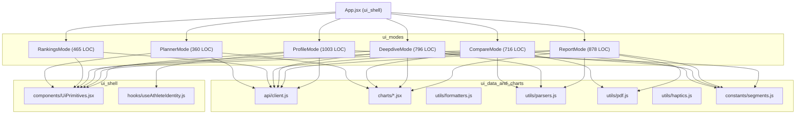

# ui_modes

`ui/src/pages/` holds the six top-level screens of the PYROX web/Capacitor app:
`ProfileMode`, `ReportMode`, `CompareMode`, `DeepdiveMode`, `RankingsMode`, and
`PlannerMode`. At 4,218 lines it is the largest single module in the repo, and
it is large for a structural reason: the repo's convention is **one component
per mode**, and each mode is a self-contained analytical view that owns its own
search form, its own filter state, its own fetch lifecycle, and its own result
rendering. Nothing in `pages/` is shared between modes — the sharing all
happens one layer down, through the API client, the chart components, the
formatters, and the UI primitives.

The module exists to keep the six analyses independent. A mode answers one
question end to end ("how did this race go?", "how do these two races
compare?", "what time do I need to podium in Season 8?"), and the price of that
independence is that the scaffolding around each answer — athlete search,
division/gender dropdowns, loading and error state, race-card selection — is
written six times rather than once. That duplication is real and is documented
in its own section below; it is the most useful thing this page has to say.

`ui/src/App.jsx` ([ui_shell](ui_shell.md)) owns mode selection. It `lazy()`-imports
all six, keeps a `mountedModes` map, and renders every visited mode
simultaneously with `style={{ display: mode === modeKey ? "block" : "none" }}`.
The consequence matters for reading this page: **modes are never unmounted
once visited**, so all the per-mode `useState` described below survives tab
switches. Every mode receives `isIosMobile`; two extra props are wired for
cross-mode navigation (`onOpenRace` into Profile, `pendingRaceJump` /
`onRaceJumpHandled` into Report). User-facing descriptions of what these
screens do live in the mkdocs site — see [docs/analytics.md](docs/analytics.md)
and [docs/filters.md](docs/filters.md) rather than restating them here.

## Shared dependency shape

Two edges are omitted from the diagram because they are universal: all six
modes import `formatMinutes` / `formatLabel` from `utils/formatters.js` and
`triggerSelectionHaptic` from `utils/haptics.js`.

Correction to the static import list this page was briefed with: **DeepdiveMode
does import `api/client.js` directly** (`ui/src/pages/DeepdiveMode.jsx:14-19`,
pulling `fetchDeepdive`, `fetchDeepdiveFilters`, `fetchFilterOptions`,
`searchAthletes`). All six modes talk to the API client directly; none of them
receives data through props from `App`.

## ProfileMode

**Question:** "Who am I in this dataset, and am I getting faster?"

`ProfileMode` is the landing mode — `getInitialMode()` in
`ui/src/constants/segments.js` returns `"profile"` unconditionally. It is also
the only mode with a persistent identity: `useAthleteIdentity()` reads and
writes `localStorage` under `pyrox.ui.athlete-identity`, so a returning user
skips the search step entirely.

The root component is a small four-state machine held in one `view` string:
`"setup"` → `"loading"` → `"profile"`, with `"error"` reachable from the load.
`SetupView` calls `searchAthletes(name, { match: "contains", requireUnique: false })`
against `/api/athletes/search`, then runs the results through
`normalizeProfileSearchResults()` — which dedupes by `athlete_id` (falling back
to lower-cased name), keeps the most recent year per athlete, and sorts
alphabetically. Claiming a result calls `handleClaim`, which persists the
identity and immediately calls `loadProfile`.

`loadProfile` hits `fetchAthleteProfile({ athleteId, name, division })`. The
client picks the endpoint: `/api/athletes/{id}/profile` when an id is present,
`/api/athletes/profile?name=` otherwise. A `mountedRef` guards both the success
and failure paths against setting state after unmount — the only mode that
bothers with this, though given `App` never unmounts a visited mode it is
arguably defensive rather than necessary.

The rendered profile is built from 18 local components. `ProfileHero` shows
initials, meta, and four summary stats via `AnimatedNumber`. `DivisionFilter`
renders only when `available_divisions` has more than one entry, and changing
it re-fetches the whole profile scoped to that division. `TimeCards` (wrapped
as `PersonalBests` and `AverageTimes`) renders one card per entry in
`PROFILE_TIME_SEGMENTS` — overall, run+roxzone, then all `STATION_SEGMENTS` —
with a percentile fill bar coloured by `getPercentileColorClass`.
`RaceHistory` rows call `onOpenRace(result_id)`, `App`'s handler that sets
`pendingRaceJump` and flips to Report mode.

The notable oddity is `FinishProgressionChart`. It does **not** use anything
from `charts/`; it hand-builds an SVG line/area chart inline (constants
`PROGRESSION_VIEW_W`, `PROGRESSION_PAD`, helpers `toChronologyTimestamp`,
`toMonthLabel`, `getProgressionMetricValue`). It carries a metric selector
driven by `PROGRESSION_METRIC_OPTIONS` and self-corrects: `availableMetricOptions`
filters to metrics with at least one non-null value across the athlete's races,
and an effect snaps `selectedMetricKey` back if the current selection isn't
available. Tooltips are dual-mode — hover for mouse, tap-to-toggle
(`toggleTooltipPoint`) for touch, with `onPointerDown` distinguishing by
`event.pointerType`.

`ProfileMode` accepts only `{ onOpenRace }`. `App` passes `isIosMobile` to it
as well, but the component ignores it, so Profile is the one mode with no
`ProgressiveSection` collapsing on small screens.

## ReportMode

**Question:** "How did this one race go against the field?"

The heaviest data consumer. State splits cleanly into a search phase and a
report phase, toggled by `view` (`"search"` | `"report"`).

Endpoints: `/api/filter-options` (via a `useQuery` for the division/gender
dropdowns), `/api/athletes/search` on submit, and `/api/reports/{result_id}`
with `cohort_time_window_min` and optional `split_name`. `fetchReport` gets a
90 s timeout in the client — the longest alongside deepdive.

The `timeWindow` filter (default `"5"`) is the mode's central idea: alongside
the age-group cohort, the backend computes a second "comparison window" cohort
of athletes finishing within ±N minutes. Nearly every card renders both.
`handleSplitChange` is a nice touch — changing the station dropdown while a
report is loaded immediately re-fetches with the override rather than waiting
for the Update button.

Charts rendered, all from [ui_data_and_charts](ui_data_and_charts.md):

- Four `HistogramChart` panels — cohort total time, window total time, selected
  split cohort, selected split window.
- Two `PercentileLineChart` panels, fed by the `percentileSeries` memo, which
  normalises `report.splits` through `normalizeSplitKey` into a map and then
  projects it onto `RUN_PERCENTILE_SEGMENTS` and `STATION_PERCENTILE_SEGMENTS`,
  converting 0–1 percentiles to clamped 0–100.
- One `WorkRunSplitPieChart` and one `RunChangeLineChart` from
  `report.plot_data.work_vs_run_split` / `.run_change_series`.

It is the only mode using the full help affordance set from `UiPrimitives`:
`ReportCardHeader` + `HelpSheet`, driven by `activeHelpKey` and the content map
from `buildReportHelpContent(filters.timeWindow)` in `utils/pdf.js`. An effect
locks `document.body.style.overflow` while the sheet is open.

PDF export is web-only: `Capacitor.isNativePlatform()` gates the button, and
`handleDownloadPdf` dynamically `import()`s `html2pdf.js` and renders the
`#report-root` node with the filename from `buildReportFilename(report.race)`.

The `pendingRaceJump` effect handles the Profile → Report deep link: it forces
`view` to `"report"`, fetches the report, and splices the returned race into
`races` if not already present. Its dependency array is
`[pendingRaceJump, onRaceJumpHandled, queryClient]` but the body reads
`filters.timeWindow` — I did not test this, but that reads as a stale-closure
hazard if a user edits the time window and then jumps from Profile in the same
session.

## DeepdiveMode

**Question:** "Across a whole season, what would a Top-5% / podium / mean time
look like, and where is my gap biggest?"

Two-column layout: pick a base race on the left, set the analysis scope on the
right, then run. Endpoints: `/api/athletes/search`, `/api/filter-options`,
`/api/deepdive/filters` (a `useQuery` gated on `enabled: Boolean(season)`,
returning locations and age groups for the chosen season/division/gender), and
`/api/deepdive/{result_id}` with season, metric, division, gender, age_group,
location, and stat.

Season is the hard requirement — `handleRunDeepdive` refuses without it. When
you select a base race card, `deepdiveParams` is seeded from that race's
season, division, gender, and age group, so the right column pre-fills from the
left. A separate effect clears `location` and `ageGroup` whenever the freshly
loaded filter payload no longer contains the current selection, which prevents
the form from sending stale scope values after a season change.

The `stat` axis (`DEEPDIVE_STAT_OPTIONS`: `p05` Top 5%, `podium`, `mean`, `p90`
Bottom 10%) reshapes the whole result client-side. `deepdiveGroupSummary`
special-cases `mean` to read `deepdiveData.summary` rather than
`group_summary[stat]`; `deepdiveDistribution` falls back from
`group_distribution[stat]` to a flat `distribution`. `deepdiveRows` computes
two deltas per location — athlete minus the stat target, athlete minus the
fastest — and sorts ascending by the first, floating the locations where you
are closest to the target to the top.

Charts: one `HistogramChart` for the cohort distribution and one `StatBarChart`
comparing the athlete against mean/median/fastest/slowest of the selected
group. The "Location targets" table carries a four-branch inline ternary that
picks a definition tooltip per stat value — the most awkward markup in the
module and an obvious candidate for a lookup object.

## CompareMode

**Question:** "Split by split, where did these two races differ?"

The most symmetric mode and the most literally duplicated: base and compare
sides are two near-identical copies of the same state block (`baseName` /
`compareName`, `baseFilters` / `compareFilters`, `baseRaces` / `compareRaces`,
`selectedBaseRaceId` / `selectedCompareRaceId`, plus four loading/error flags
each) and two near-identical copies of the same JSX column.

It calls `/api/reports/{result_id}` twice with no options — the query key is
`["report", id, "", ""]`, sharing the react-query namespace with ReportMode but
with different key tails, so the two modes will not accidentally hand each
other a differently-parameterised report. `handleLoadCompareReport` rejects
selecting the same `result_id` on both sides.

Diffing is done entirely client-side in two memos. `comparisonRows` builds the
table: total time, `sumTimes(run_time_min, roxzone_time_min)`, then the union
of split keys from `buildSplitTimeMap` on both reports, sorted by display name.
`comparisonCharts` maps `RUN_SEGMENTS` and `STATION_SEGMENTS` through
`pickSegmentValue`, which prefers a matching split row and falls back to the
race-level column — that fallback is what lets comparison work across races
whose split rows are incomplete. Two `GroupedBarChart` panels render the
result; the table colours deltas via the `delta-positive` / `delta-negative` /
`delta-even` class ternary.

PDF export mirrors ReportMode's, targeting `#compare-root` with
`buildComparisonFilename(baseRace, compareRace)`.

One small asymmetry: `handleCompareSearch` clears `compareRaces` before
searching, `handleBaseSearch` does not clear `baseRaces`. Results are
overwritten on success either way, but a *failed* base search leaves the
previous race cards on screen while a failed compare search empties the column.

## RankingsMode

**Question:** "Who is fastest in this cohort, and where would my time place?"

The only mode with hard-required filters and no athlete search step. Season,
division, and gender are all mandatory (`requiredFiltersReady`), and both the
secondary filter query and the submit handler are gated on them.

Endpoints: `/api/filter-options` for the three required dropdowns,
`/api/rankings/filters` (a `useQuery` enabled on `requiredFiltersReady`) for
age groups and in-scope locations, and `/api/rankings` on submit with the added
optional `athlete_name`, `target_time_min`, and `limit` (default `"200"`).

The `targetTime` field is the mode's distinctive feature: the backend returns a
`placement_lookup` object and the UI renders "a 63:30 finish would place #N of
M", including exact-match count when present. Beyond that it is presentation —
a summary card with `activeFilterTags`, an ordered leaderboard list, a
locations-considered card, and a nine-column ranking table. It renders **no
charts at all**, the only analytical mode that is pure tables and lists.

## PlannerMode

**Question:** "For a race I haven't run yet, what does the field look like?"

The smallest and simplest mode, and the only one with no athlete concept
whatsoever — there is no name input anywhere. All seven filters (season,
location, year, division, gender, min/max total time) are optional; submitting
an empty form is legal and queries the whole dataset.

Endpoints: `/api/filter-options` for every dropdown (this is the only mode that
uses the `locations` and `years` arrays from that payload) and `/api/planner`
on submit.

The entire result is a fan-out of `HistogramChart`. `plannerData.segments`
arrives pre-shaped from the backend with `group`, `key`, `label`, `histogram`,
and `stats`; `plannerGroups` buckets them into `overall` / `runs` / `stations`
and each bucket renders as a chart grid. Because histogram construction is
server-side, PlannerMode does essentially no data transformation — it is a good
reference for what the other modes would look like if their shaping logic moved
into [reporting_engine](reporting_engine.md).

## Duplication and inconsistency

This is the section the page exists for. With six large siblings, the repeated
scaffolding is substantial and largely mechanical.

**The `filterOptionsQuery` block is copy-pasted five times.** ReportMode,
DeepdiveMode, CompareMode, RankingsMode, and PlannerMode each contain the
identical `useQuery({ queryKey: ["filter-options"], queryFn: () => fetchFilterOptions() })`
followed by the same `Array.isArray(...) ? ... : []` guards for divisions and
genders (and, in Rankings/Planner, seasons/locations/years). The shared query
key means only one network request happens, so this is a code-duplication
problem rather than a performance one — but a `useFilterOptions()` hook would
delete roughly 60 lines across the module.

**The athlete-search handler is written four times.** `handleSearch`
(ReportMode), `handleDeepdiveSearch`, `handleBaseSearch` and
`handleCompareSearch` are the same eleven-step function with renamed state:
validate the name, set loading, clear errors and downstream state, `fetchQuery`
with key `["athletes-search", <mode-tag>, name, match, gender, division, requireUnique]`,
`setRaces(payload.races || [])`, catch into an error string, clear loading in
`finally`. The only real variation is which downstream state gets reset.

**The race-card markup is copy-pasted four times** — ReportMode, DeepdiveMode,
and both columns of CompareMode render byte-for-byte the same
`.race-card` / `.race-card-header` / `.race-meta` / `.race-time` block including
the `animationDelay: ${index * 0.04}s` stagger. Only the click handler differs.
This is the single largest duplicated JSX region in the module.

**Every mode hand-rolls the fetch lifecycle.** `@tanstack/react-query` is
present in all six, but `useQuery` is used only for the *filter option*
endpoints. Every primary analytical fetch goes through `queryClient.fetchQuery`
inside an imperative async handler with loading and error mirrored into local
`useState` (`reportLoading` / `reportError`, `deepdiveLoading` /
`deepdiveError`, `rankingLoading` / `rankingError`, …). React Query is a cache
here, not a state manager. Defensible for user-triggered actions, but it means
six independent implementations of loading/error handling that can drift.

**Smaller repeats:**

- `buildOptions(payload)` is defined identically (modulo key order) at the top
  of both `DeepdiveMode.jsx` and `RankingsMode.jsx`.
- The `delta-positive` / `delta-negative` / `delta-even` class ternary appears
  three times (twice in DeepdiveMode's table, once in CompareMode's).
- The `html2pdf` options object — margin, jpeg quality 0.95, `scale: 2`, letter
  portrait — is duplicated verbatim in ReportMode and CompareMode.
- The four-line `.skeleton-panel` loading block appears in ProfileMode,
  DeepdiveMode, RankingsMode, PlannerMode, and again in `App.jsx`.
- `ProfileMode` defines its own `toFiniteNumber()` which is functionally
  `toNumber()` from `utils/parsers.js`; it does not import parsers at all.

**Inconsistencies between modes:**

- *Help affordances come in three flavours.* ReportMode uses the
  `ReportCardHeader` + `HelpSheet` bottom-sheet pattern; DeepdiveMode uses the
  `infoTooltip` prop on charts plus raw `.info-tooltip` spans in table headers;
  ReportMode *also* uses raw `.info-tooltip` spans in its snapshot card. The
  other four modes have no help affordance at all.
- *ProfileMode is stylistically the odd one out* — 18 local sub-components
  where the other five are one big function, its own inline SVG chart instead
  of `charts/`, its own `ordinal()` and `getInitials()` helpers, a `mountedRef`
  guard nobody else uses, and no `ProgressiveSection` usage despite `App`
  passing it `isIosMobile`.
- *`ProgressiveSection` scope varies.* Report and Compare collapse only the
  division/gender pair; Deepdive collapses age group, metric, stat, and
  location; Rankings collapses four optional fields; Planner collapses three.
  Nothing is wrong with that, but there is no rule about what counts as
  "advanced".

**Dead code:** `ui/src/charts/SeasonProgressionChart.jsx` exports
`SeasonProgressionChart` and is imported by nothing in `ui/src` except its own
test at `ui/src/__tests__/charts/SeasonProgressionChart.test.jsx`. ProfileMode's
inline `FinishProgressionChart` appears to have superseded it. Removing it, or
refactoring ProfileMode onto it, would be a clean win — I have not checked git
history to confirm which came first.

**Test coverage is uneven.** `ui/src/__tests__/pages/` contains
`ProfileMode.test.jsx`, `ReportMode.test.jsx`, `DeepdiveMode.test.jsx`, and
`PlannerMode.test.jsx`. **`CompareMode` and `RankingsMode` have no page-level
tests** — 1,181 LOC, including all of CompareMode's client-side split-diffing
logic, is untested at the component level.

## Where to look next

- API endpoint contracts and the `apiFetch` timeout table:
  [ui_data_and_charts](ui_data_and_charts.md).
- Mode routing, lazy loading, `UiPrimitives`, and the identity hook:
  [ui_shell](ui_shell.md).
- The FastAPI handlers these modes call (`pyrox_api_service/app.py`):
  [service_runtime](service_runtime.md).
- How percentiles, cohorts, and histograms are actually computed server-side:
  [reporting_engine](reporting_engine.md).
- User-facing feature docs: [docs/analytics.md](docs/analytics.md),
  [docs/filters.md](docs/filters.md).
