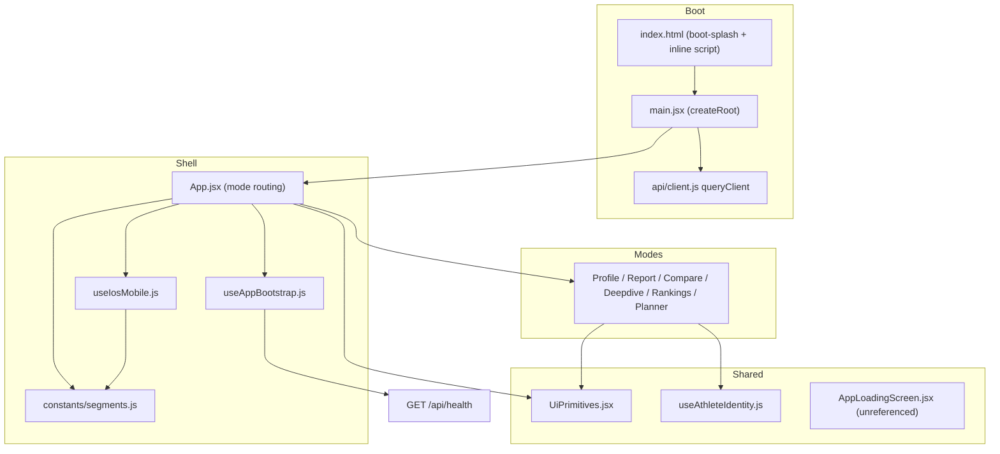
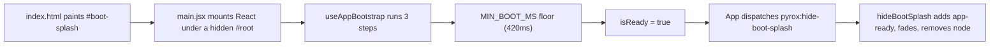

# ui_shell — the React application shell and primitives library

`ui_shell` is the thin layer of the frontend that everything else hangs off.
It owns the HTML entry point, the React root, the single top-level component
(`App`), three cross-cutting hooks (bootstrap, athlete identity, iOS platform
detection), a small set of shared presentational primitives, and the
Vite/Vitest configuration that builds and tests the whole `ui/` tree. There is
no router library and no global state container — the shell *is* the router,
and `useState` in `App` is the navigation state.

The structurally interesting thing about this module is that it sits on **both
sides** of the page modes. Above them, `App.jsx` decides which of the six modes
is visible and lazily mounts it. Beneath them, `components/UiPrimitives.jsx` is
a hub imported by five of the six modes for shared widgets, and
`hooks/useAthleteIdentity.js` is imported by `ProfileMode`. So the dependency
arrows run shell → modes for composition and modes → shell for primitives. If
you are looking for a layering violation, that is not one — the primitives file
imports nothing from the app except React — but it does mean "the shell" is not
a single layer, and the two roles should be kept mentally separate.

Related pages: [ui_modes](ui_modes.md) for the six page modes,
[ui_data_and_charts](ui_data_and_charts.md) for the API client, constants and
chart components, and [service_runtime](service_runtime.md) for the HTTP
service the UI talks to.

## Shape of the module

## The boot sequence, concretely

Boot is a three-stage handoff between plain HTML, `main.jsx`, and `App`. It is
worth reading in that order because each stage hides the previous one.

**Stage 1 — `ui/index.html`.** The document ships a `#boot-splash` div
containing the PYROX wordmark, styled by an inline `<style>` block, plus an
inline script that runs before React loads. That script sniffs for a Capacitor
runtime (`capacitor:` / `ionic:` protocol, or `"Capacitor"` in the user agent)
and, if found, adds `native-capacitor` and `app-ready` to `<html>`. The
stylesheet rule `html:not(.app-ready) #root { opacity: 0; visibility: hidden }`
is what actually keeps the app invisible until someone sets `app-ready`, and
`html.native-capacitor #boot-splash { display: none }` suppresses the web splash
on device, where Capacitor's own native splash screen is already showing (see
`capacitor.config.json`: `launchShowDuration: 1200`, `launchAutoHide: true`).

**Stage 2 — `ui/src/main.jsx`.** Fifty lines, four jobs. It imports the six
global stylesheets in a deliberate cascade order (`tokens`, `base`,
`components`, `charts`, `layouts`, `bootstrap`); it calls `createRoot` on
`#root` and renders `<App/>` inside a `QueryClientProvider` fed by the shared
`queryClient` from `api/client.js` — that is the module's only import from
[ui_data_and_charts](ui_data_and_charts.md) besides constants; it repeats the
same `isNativeCapacitorRuntime()` check as the inline script and removes the
splash node outright on native; and it registers a one-shot listener for the
custom DOM event `pyrox:hide-boot-splash`. `hideBootSplash` adds `app-ready` to
`<html>`, adds `is-hidden` to the splash for the 180 ms CSS fade, then removes
the node after a 220 ms timer.

**Stage 3 — `App` + `useAppBootstrap`.** `App` calls
`useAppBootstrap(API_BASE)`, and an effect fires
`window.dispatchEvent(new Event("pyrox:hide-boot-splash"))` once
`!isBootstrapping && isReady`. That event is the only producer for the listener
in `main.jsx`; the two files are coupled purely through the event name string,
which is easy to miss when grepping.

So what the user sees while waiting is *not* a React component. It is the
static HTML splash — wordmark on a dark radial gradient — held on screen until
the bootstrap hook says ready, then cross-faded out. On iOS the web splash never
appears at all; the native Capacitor splash covers the same window.

### What `useAppBootstrap` actually waits for

`ui/src/hooks/useAppBootstrap.js` runs a sequential list of three labelled
steps and tracks `{ isBootstrapping, isReady, progress, status, warning }`:

1. `"Checking session..."` — calls `readStoredSession()`, which reads and
   `JSON.parse`s `localStorage["pyrox.auth.session"]` and *throws the result
   away*. Nothing else in `ui/src` reads or writes that key. This step is a
   placeholder for an auth check that does not exist yet; treat it as reserved
   space rather than behaviour.
2. `"Connecting to race service..."` — the only real work. `checkHealth` does a
   `fetch` of `` `${apiBase}/api/health` `` behind an `AbortController` armed
   with a `NETWORK_TIMEOUT_MS` timer, throws on a non-OK status, and parses the
   JSON body. `apiBase` comes from `API_BASE` in `constants/segments.js`, which
   resolves per platform (`http://127.0.0.1:8000` on iOS, `10.0.2.2` on
   Android, `VITE_API_BASE_URL` when configured).
3. `"Preparing dashboards..."` — reads `localStorage["pyrox.ui.last-mode"]` and
   discards it, same as step 1. `App` *writes* that key on every mode change,
   but nothing reads it back for real; `getInitialMode()` in `segments.js`
   unconditionally returns `"profile"`. Another reserved slot.

Failures do not stop the loop. Each step is individually `try`/`catch`ed and a
throw only sets the `warning` string — an `AbortError` becomes `"Connection
timed out. You can still browse the app."`, anything else uses the error's
message. Because `warning` is assigned rather than accumulated, a later failing
step overwrites an earlier one; with only step 2 able to fail today that is
invisible, but it is a latent bug if steps are added.

**The two constants encode the boot UX:**

- `MIN_BOOT_MS = 420` is a *floor*, not a delay budget. After the steps finish,
  the hook sleeps for whatever remains of 420 ms. On a warm local service the
  health check returns in a few milliseconds, and without the floor the splash
  would flash and vanish inside one or two frames — visually a glitch. The floor
  buys a deliberate, calm brand moment. It is paid on every mount and on every
  manual retry.
- `NETWORK_TIMEOUT_MS = 6500` is the *ceiling* on how long a dead or slow
  backend can hold the splash. Past 6.5 s the fetch aborts, the warning is set,
  and boot completes anyway. So worst-case time-to-interactive is roughly 6.5 s,
  after which the app is fully usable and simply shows a banner. This is an
  offline-tolerant design: the health check gates the *message*, never access.

Note that `useAppBootstrap`'s own timeout is separate from and shorter than the
per-endpoint timeouts in `api/client.js` (15 s default, up to 90 s for report
and deepdive queries) — see [ui_data_and_charts](ui_data_and_charts.md).

The hook returns `{ ...state, retryBootstrap }` where `retryBootstrap` is the
same `useCallback`-wrapped `runBootstrap` the mount effect calls, so the retry
button re-runs the identical sequence. An `isMountedRef` guards the two
`setState` calls that can land after unmount. Note that the ref is set back to
`true` at the *start* of the effect body rather than only in a lazy initialiser
— fine in practice, mildly unusual.

`App` consumes only four of the five returned fields: `isBootstrapping`,
`isReady`, `warning`, `retryBootstrap`. **`progress` and `status` are computed
and never rendered anywhere.**

### `AppLoadingScreen` is dead code

`ui/src/components/AppLoadingScreen.jsx` renders a `.bootstrap-screen` dialog
with the wordmark and an `is-exiting` transition class. A repo-wide grep finds
no importer — not `App.jsx`, not any mode, not any test. `ui/src/styles/
bootstrap.css` still carries a matching, and also unused, vocabulary:
`.bootstrap-status-wrap`, `.bootstrap-title`, `.bootstrap-status`,
`.bootstrap-progress`, `.bootstrap-progress-bar`, `.app-shell-content
.is-obscured`, `body.app-booting`. Read together with the unused `progress` and
`status` fields, the picture is clear: there was once a React loading screen
with a progress bar driven by the hook, and it was replaced by the static
HTML splash — which is strictly better, since the HTML splash paints before the
JS bundle downloads. The React component and its CSS were left behind. Only the
`.bootstrap-warning` rules in that stylesheet are live. This is an inference
from the code shape, not from any commit or comment I read, but the evidence is
strong.

One smaller loose end in the same family: `App` renders
`` className={`app-shell${isReady ? " is-ready" : ""}`} `` and no stylesheet
defines `.app-shell.is-ready`. The class is inert today.

## `App.jsx` — routing without a router

`App` holds four pieces of state: `mode` (the active tab), `mountedModes` (a
set-as-object of modes that have ever been selected), `pendingRaceJump`, and a
`sectionRefs` ref map.

Navigation is a `MODE_ORDER` array — `profile, report, compare, deepdive,
rankings, planner` — and a `MODE_CONFIG` map from key to `{ label, component }`,
where each component is a `React.lazy` dynamic import. Vite therefore code-splits
every mode into its own chunk, which is why `vite.config.js` raises
`chunkSizeWarningLimit` to 700 kB. `handleModeChange` validates against the
`VALID_MODES` set from `constants/segments.js` before setting state, then
smooth-scrolls to the top.

The rendering strategy is deliberately not "render the active mode". Every mode
that has *ever* been visited stays mounted and is hidden with
`style={{ display: mode === modeKey ? "block" : "none" }}` plus
`aria-hidden`. Consequences worth knowing:

- Switching back to a mode is instant and preserves all of its local state,
  form inputs and scroll position. This is the main reason the design exists.
- Hidden modes keep running. Their React Query subscriptions stay live, so a
  background refetch can fire for a tab the user cannot see.
- The `.mode-section` CSS entry animation would only play on first mount, so an
  effect force-restarts it on every mode change by setting
  `el.style.animation = "none"`, reading `el.offsetHeight` to force reflow, then
  clearing the override. That is the purpose of `sectionRefs` — the only reason
  it exists.

Cross-mode communication is one narrow channel: `ProfileMode` receives
`onOpenRace`, which stores a `resultId` in `pendingRaceJump` and switches to
`report`; `ReportMode` receives `pendingRaceJump` and an `onRaceJumpHandled`
callback to clear it. Every mode also receives `isIosMobile`. That is the whole
prop contract between shell and modes — see [ui_modes](ui_modes.md) for how the
modes use it.

Chrome rendered by the shell itself: a `<header class="hero">` with the
`/brand-wordmark.svg` wordmark; the bootstrap warning banner
(`role="status" aria-live="polite"`) with its retry button, which disables and
relabels itself to `"Retrying..."` while `isBootstrapping`; and the `.mode-tabs`
bar, whose buttons pair a `ModeTabIcon` with the mode label. A `Suspense`
boundary wraps each lazily loaded mode with `ModeLoadingFallback`, a three-line
skeleton panel defined inline in `App.jsx`.

## iOS and Capacitor

The web app doubles as a native iOS app through Capacitor 6
(`@capacitor/core`, `@capacitor/ios`, `@capacitor/cli`), configured at
`ui/capacitor.config.json` with app id `com.pyrox.app`, `webDir: "dist"`, and
the splash-screen plugin settings mentioned above. The build path is
`npm run build:cap` (`vite build --mode capacitor && npx cap sync`), then
`npm run cap:open:ios`. `vite.config.js` sets `base: "./"` specifically so the
built bundle works from a `capacitor://` origin where absolute paths would not
resolve. The generated Xcode project under `ui/ios/` is out of scope for this
wiki; the build runbook lives in
[docs/maintainers/reporting-service.md](../docs/maintainers/reporting-service.md)
under its "iOS (Capacitor)" section.

**`useIosMobile()`** (`ui/src/hooks/useIosMobile.js`) answers one question:
should the UI use its phone layout? It is deliberately broader than "are we
native". It ORs `Capacitor.getPlatform() === "ios"` with
`isIosBrowserDevice()` from `constants/segments.js` (which matches
`iPad|iPhone|iPod` user agents and the `MacIntel` + `maxTouchPoints > 1`
signature of an iPad in desktop mode), then requires the
`IOS_MOBILE_MEDIA_QUERY` — `(max-width: 900px)` — to match. It subscribes to
that media query with `addEventListener("change", ...)` and falls back to the
deprecated `addListener` for older WebKit. So Safari on an iPhone gets the
mobile treatment without being a native build; a wide iPad does not.
`Capacitor.getPlatform` is called defensively (`Capacitor.getPlatform ? ... :
"web"`), which suggests a past problem with the plugin shim in a test or SSR
context.

`App` translates the boolean two ways: an effect toggles `body.ios-mobile`
(with cleanup on unmount), and the inner container gets `ios-mobile-shell`.
`body.ios-mobile` is where the real work happens in `styles/layouts.css` —
most visibly, `.mode-tabs` becomes a `position: fixed` bottom tab bar inset by
`var(--safe-bottom)`, with 44 px minimum touch targets and icon-over-label
stacking, i.e. an iOS-native-feeling tab bar rather than the web's horizontal
strip.

Safe areas are handled in CSS, not JS. `styles/tokens.css` defines
`--safe-top` / `--safe-bottom` from `env(safe-area-inset-*)`, `index.html` sets
`viewport-fit=cover` so those values are non-zero, and `layouts.css` pads `.app`
inside an `@supports (padding: env(safe-area-inset-top))` guard.

Haptics are *not* wired in this module. `ui/src/utils/haptics.js` registers a
Capacitor `"Haptics"` plugin and exports `triggerSelectionHaptic`, and each of
the six modes calls it directly on selection changes. Notably the shell's own
mode-tab buttons — arguably the most tap-heavy control in the app — do **not**
trigger a haptic. Whether that is intentional restraint or an oversight I
cannot tell from the code.

## The primitives (`components/UiPrimitives.jsx`)

195 lines, five named exports on the last line:
`AnimatedNumber, HelpSheet, ModeTabIcon, ProgressiveSection,
ReportCardHeader`. (An index elsewhere describes this file as having eight
exports; the file itself exports five. The extra three are presumably the
module-local symbols `easeOutCubic`, `useAnimatedValue` and `CardHelpButton`,
which are defined but not exported.) Fan-in is six importers: `App.jsx` plus
five modes.

- **`useAnimatedValue(target, duration = 600)`** — module-private. Animates
  0 → `target` with `requestAnimationFrame` and an `easeOutCubic` curve. It
  bails to `0` for null/undefined/non-finite targets, skips re-animating when
  the target is unchanged (`prevTargetRef`), jumps straight to the value under
  `prefers-reduced-motion: reduce`, and cancels its RAF on cleanup. Note that
  `fromRef` is reset to `0` on every run, so a changed target counts up from
  zero again rather than tweening from the previous value — a reveal effect,
  not an interpolation.
- **`AnimatedNumber({ value, formatter, duration })`** — the exported wrapper.
  Renders `formatter(animated)` or a rounded string; for a non-finite `value`
  it renders `formatter(value)` or the em-dash `"—"`. Used by `ProfileMode`.
- **`CardHelpButton({ onClick })`** — module-private; a "How calculated" button.
- **`ReportCardHeader({ title, helpKey, onOpenHelp })`** — an `<h4>` plus, when
  `helpKey` is set, a `CardHelpButton` wired to `onOpenHelp(helpKey)`. This is
  the pairing that makes the help affordance consistent across report cards.
- **`HelpSheet({ content, onClose })`** — a modal bottom sheet
  (`role="dialog"`, `aria-modal`, labelled by `#help-sheet-title`) that closes
  on Escape via a window `keydown` listener and on backdrop click, with
  `stopPropagation` on the sheet itself. `content` is `{ title, summary,
  bullets?, formula? }`; bullets are keyed by their own text, so duplicate
  bullet strings in one sheet would collide. It does not trap focus or restore
  focus on close — an accessibility gap I checked for and did not find.
- **`ProgressiveSection({ enabled, summary, children, defaultOpen })`** — the
  most reused primitive (four modes). When `enabled` is false it renders
  `children` bare; when true it wraps them in a `
`
  with `summary` as the `
`. In practice `enabled` is the `isIosMobile`
  flag, so advanced form controls collapse behind a disclosure on phones and
  stay expanded on desktop. That is the shell's iOS flag reaching all the way
  into form layout.
- **`ModeTabIcon({ kind })`** — inline stroke SVG glyphs for `report`,
  `compare`, `deepdive`, `rankings`, `profile`, with a bar-chart glyph as the
  fallback. Note there is no explicit `planner` branch: the planner tab renders
  the fallback icon. Whether that was intended or is simply an unfinished case
  is not stated anywhere. Stroke, fill and width come from CSS
  (`body.ios-mobile .mode-tab-icon svg` and its non-iOS counterparts), not from
  the SVG markup.

`ReportMode.test.jsx` mocks this whole module, which is a reasonable signal
that it is treated as a stable shared surface rather than something to test
through.

## `useAthleteIdentity`

`ui/src/hooks/useAthleteIdentity.js` is a 50-line `localStorage`-backed store
for "who is the user", exporting the key constant
`ATHLETE_IDENTITY_KEY = "pyrox.ui.athlete-identity"` and the hook itself. The
stored shape is `{ athleteId?, name?, setAt? }`.

`readStoredIdentity()` is defensive to a degree worth calling out: it guards
`typeof window`, wraps everything in `try`/`catch` so malformed JSON yields
`null`, requires the parsed value to be a non-array object, coerces `athleteId`
and `name` to trimmed strings, drops anything that is not a string, returns
`null` when both are empty after trimming, and only copies `setAt` through when
it is a string. `persistIdentity()` writes JSON or removes the key for a null
identity, swallowing quota/privacy-mode errors silently. The hook seeds
`useState` with the reader as a lazy initialiser and returns
`{ identity, setIdentity, clearIdentity }`, where `setIdentity` writes through
to storage before updating React state.

Two caveats. There is no cross-tab or cross-component synchronisation: two
components calling `useAthleteIdentity()` get two independent `useState`
instances backed by the same key, and no `storage` event listener keeps them in
step. Today that is harmless because `ProfileMode` is the sole consumer — a
second consumer would expose it immediately. And `setIdentity` is recreated on
every render (no `useCallback`), so passing it into a memoised child defeats the
memoisation.

Given the depth of the validation and the 130-line test file at
`ui/src/__tests__/hooks/useAthleteIdentity.test.js` — the only hook in the
module with dedicated tests — this hook has clearly been burned by bad stored
data before.

## Build and test configuration

`ui/vite.config.js` is eleven lines: `base: "./"` (required for the Capacitor
`file://`-like origin), the React plugin, `outDir: "dist"` (matching
`webDir` in `capacitor.config.json`), and `chunkSizeWarningLimit: 700` to
accommodate the lazily loaded mode chunks.

`ui/vitest.config.js` `mergeConfig`s the Vite config so tests resolve modules
exactly as the app does, then adds `environment: "jsdom"`, `globals: true`
(hence bare `describe`/`it`/`vi` in test files), `setupFiles:
"./src/test-setup.js"`, and `css: true` so class-name assertions work against
real stylesheets. `ui/src/test-setup.js` is a single line importing
`@testing-library/jest-dom`.

Scripts in `ui/package.json`: `dev`, `build`, `preview`, `test` (watch),
`test:run` (single pass), plus the Capacitor set `build:cap`, `cap:sync`,
`cap:open:ios`, `cap:open:android`. An Android open script exists even though
only `@capacitor/ios` is installed, so `cap:open:android` would need
`npx cap add android` first.

Runtime dependencies are minimal and worth noting for what is *absent*: React
18.3, `@tanstack/react-query` 5, `@capacitor/core`, `@capacitor/ios`, and
`html2pdf.js`. No router, no state library, no CSS framework, no charting
library — the charts in [ui_data_and_charts](ui_data_and_charts.md) are
hand-rolled SVG.

Of this module's own files, only `useAthleteIdentity` has tests. `App.jsx`,
`main.jsx`, `useAppBootstrap` and `useIosMobile` are untested; the boot
sequence, the mount-once-keep-mounted routing behaviour, and the
`pyrox:hide-boot-splash` event handshake are all verified only by running the
app.
