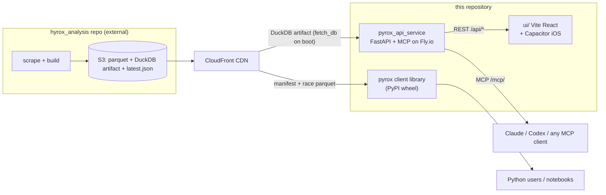

# Overview

One repo, three deliverables. The `pyrox` client library (`src/pyrox`) is the
published PyPI package and the only code that ships in the wheel. The reporting
service (`pyrox_api_service/`) is a FastAPI app over a DuckDB file, deployed to
Fly.io at `pyrox-api.fly.dev`, with a public read-only MCP endpoint at `/mcp/`.
The UI (`ui/`) is a Vite/React frontend that doubles as an iOS app via
Capacitor. Data is built elsewhere: the external `hyrox_analysis` repo scrapes
and publishes everything this repo consumes.



Two independent read paths sit over the same upstream data. `PyroxClient` pulls
a CSV manifest and per-race parquet straight from the CDN, caching locally under
`~/.cache/pyrox`; no server involved. The service instead opens one ~1.16 GB
DuckDB artifact, downloaded and sha256-verified on container boot by
`fetch_db.py`, and serves aggregate queries.

## Decisions that shape the code

The MCP server wraps the HTTP service, never the raw client, and its tools are
intent-shaped (distribution, rankings, race report) rather than raw SQL. ADR
`docs/adr/0001-mcp-over-http-reporting-service.md` explains why: cohort math
lives in exactly one place, and a public SQL surface was rejected as an
injection and runaway-query risk. The accepted cost is that new question types
need a backend change.

REST and MCP ship as a single ASGI app: `mcp_app.py` mounts FastMCP at `/mcp`
on the FastAPI app, and MCP tools call the REST endpoints in-process. Deploy
one thing, get both protocols.

The wheel stays lean on purpose. `pyproject.toml` excludes the service, the UI,
and `src/pyrox/helpers.py` from the package; `scripts/verify_wheel_contents.py`
fails the release if that discipline slips.

## Source map

| Path | What it is |
|---|---|
| `src/pyrox/` | Client library: `core.py` (PyroxClient, caching), `reporting.py` (ReportingClient, DuckDB), `errors.py`, `constants.py`. `api/` is a legacy shim, don't extend it |
| `pyrox_api_service/` | `app.py` (routes only), `reporting_queries.py` (query logic, largest file), `race_report_loader.py` (bounded loading), `database.py` (DuckDB seam), `ratelimit.py`, `fetch_db.py`, `mcp_app.py` + `mcp_tools.py` |
| `ui/src/` | `pages/` (one component per mode), `charts/`, `api/client.js`, `hooks/`, `utils/` |
| `tests/` | pytest suite; UI tests live in `ui/` under vitest |
| `docs/` | User-facing mkdocs site, plus `docs/maintainers/` runbooks and `docs/adr/` |
| `scripts/` | `release.sh`, `smoke_mcp.py`, `verify_wheel_contents.py` |

## Operating it

Runbooks are canonical in `docs/maintainers/` (release steps, service env vars,
local run, iOS build). The short version: Fly scales to zero and keeps the
DuckDB artifact on a persistent volume, so only the first cold boot pays the
download; `refresh-data.yml` restarts warm machines weekly after the upstream
Tuesday publish; releasing means `./scripts/release.sh <version>` then pushing
the tag. `fetch_db.SUPPORTED_SCHEMA_VERSION` refuses artifacts newer than the
code understands.

## Commands

```bash
uv pip install -e ".[api]"                 # editable install with service deps
uv run --with pytest python -m pytest -q   # unit tests
ruff check . && ruff format .              # lint/format
uvicorn pyrox_api_service.mcp_app:app      # REST + MCP locally (needs the DuckDB file)
cd ui && npx vitest run                    # UI tests
```

Tests mirror source paths, `test_*.py` under `tests/`, and the root
`conftest.py` makes `src/` importable without an install. MCP tool logic is
kept in plain functions precisely so it unit-tests without an MCP session;
preserve that split when adding tools. The live MCP smoke test
(`scripts/smoke_mcp.py`) was dropped from CI for flakiness in `e87ba7b`, so run
it manually after a deploy.
